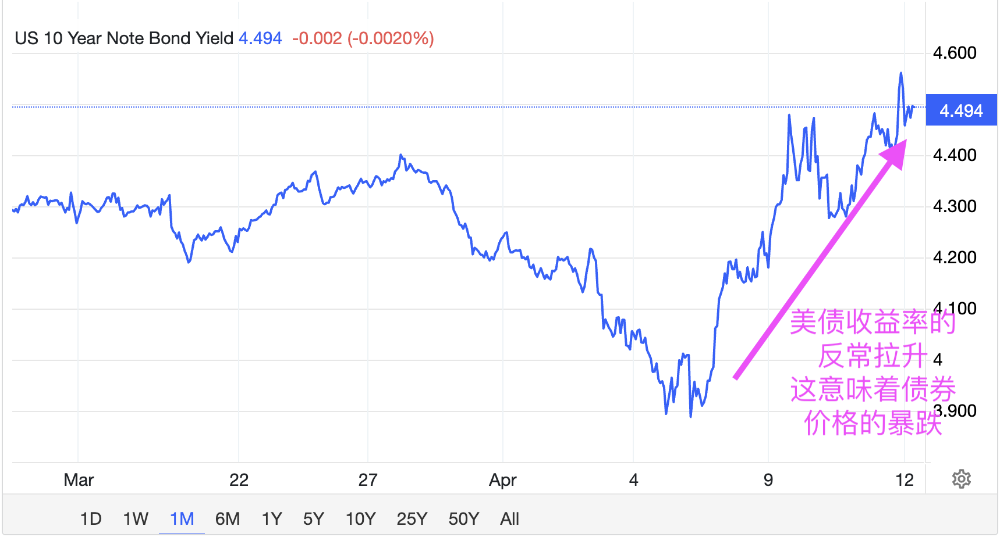

# 反复收割恐令市场持续失血

一觉醒来，BTC再次站上85k。今4.13教链内参《第14周 川皇关税撞到南墙 反复横跳戏耍市场》。美豁免了一些手机、电脑、低端芯片等电子产品和元器件的输美关税。这身段柔软的可怕。以至于有国外网友调侃说：「我们将对所有中国商品全面加征关税——除了我们需要进口的99%以外！」

陆续有外国网友爆料说，有内幕交易者在市场反复拉砸期间大开杠杆，来回反复收割，大赚特赚。有些帖子发出不久就被删了。抑或是自己删了。

教链在今4.13教链内参《第14周 川皇关税撞到南墙 反复横跳戏耍市场》中复盘了今年初以来的两次大型收割现场，一次是年初的trump meme，一次就是最近的关税。令人深感忧虑的是，肆无忌惮的反复收割，只会让市场持续失血。基础流动性的持续恶化，让利好化作诱多杀多的陷阱，套死每一个信了庄家炮制的后市利好消息的傻韭菜。

当美股、美债、美元出现股债汇三杀局的时候，聪明的资本就要开始慌不择路地逃离美元资产了。

教链在今4.13教链内参《第14周 川皇关税撞到南墙 反复横跳戏耍市场》中提到，The Kobeissi Letter分析认为，美债收益率的飙升倒逼了川皇的一再退让。 

The Kobeissi Letter分析道：数周来，特朗普总统坚称绝不推迟加税，即便股市已蒸发逾12万亿美元。然而债券市场崩盘仅12小时后，90天关税缓征令便火速落地。

在4月2日所谓对等关税实施前，10年期美债收益率呈直线下跌态势。这意味着利率下行给了关税战持续的空间。

然而随着波动性加剧导致基差交易平仓，10年期收益率暴涨65个基点至4.50%。

然而，4月7日形势突变——伴随股市下跌，利率开始飙升。

如下图所示，标普500指数与10年期美债收益率的分化程度已达历史性水平。

尽管债券被视为避险资产，但其崩盘速度甚至比股票更为迅猛。

随后在4月7日美东时间上午10:15，首批关于90天关税缓期的新闻标题开始涌现。

白宫随即宣称这是“假新闻”，但如今事实表明这绝非虚假消息。

就在10年期美债收益率飙升之际，特朗普很可能正与顾问团队商讨这项90天缓征计划。

两天后的4月9日，90天关税缓征令正式公布。

随后特朗普基本证实此举源于债市波动："我当时密切关注债券市场。这个市场非常棘手。你们看看现在，走势多漂亮。"

这显然是一次利率驱动的政策转向。

更具体地说，在视频片段结尾处他表示："没错，我昨晚注意到有些人开始坐立不安了。"

这里特指前文所述基差交易平仓现象——特朗普心知肚明，若不加以干预，8000亿美元的基差交易平仓将把10年期收益率推高至5%。

由于基差交易崩盘，避险资金再次迅速涌入黄金市场。

而随着美元的大幅走软，全球M2折算美元计价再创新高。

山雨欲来风满楼。
