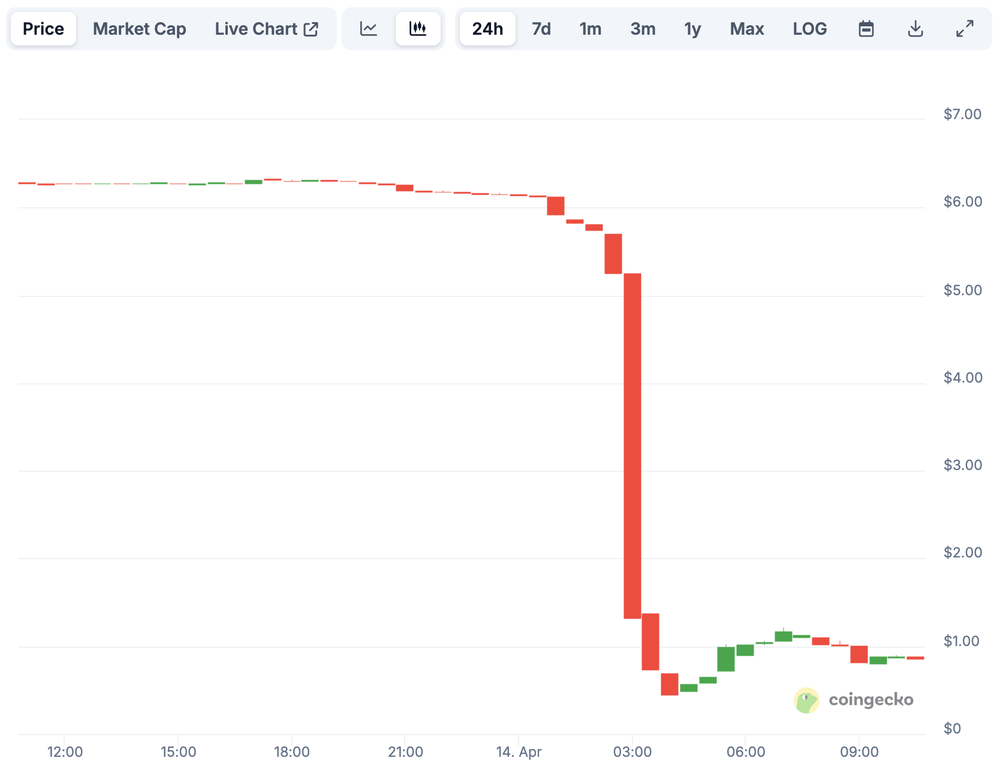

# 镰刀落下

（虚构创作，如有雷同，实属巧合）

隔夜今晨，BTC正在85k附近努力地把30均线作为支撑位来捍卫。山寨币的大割们却疑似已经开始收网。交易所App上的K线突然像断了线的风筝，带着无数人的心跳笔直下坠。数字的崩塌比迪拜塔的烟花更耀眼夺目。教链下意识摸了摸桌上的咖啡杯，冰凉的触感提醒着这并非幻觉。于是奋笔疾书，刷刷刷写就了今日4.14教链内参《闪崩！一夜暴跌85%》。

三个月前，铺天盖地的软文把山寨币的LOGO植入韭菜们的视觉印象。“中东土豪背书”、“迪拜豪宅代币化”的字样在视网膜屏幕上闪烁，像极了沙漠中的海市蜃楼。西装革履的布道者，在超五星级酒店宴会厅里晃动着红酒杯：“这是普通人拥抱石油美元的最后机会。” 觥筹交错间，质押年化收益的PPT投影在幕布上，恍若炼金术士的魔法阵。

午夜的加密社群此刻正上演荒诞剧。爆仓提醒如同除夕夜的爆竹接连炸响。有人截图凌晨三点发的“格局宣言”，红色箭头还在倔强地指向月亮，而发信人的头像已永远变成灰色。

甩锅公告准时弹出，吞噬着最后的侥幸。那些曾用来解释百倍涨幅的圣经——“稀缺模型”、“生态赋能”，此刻在K线废墟里碎成代码残片。这一切令人突然想起家乡的麦田，沉甸甸的穗子低下头时，月光下的镰刀总是格外锋利。

东方泛起第一缕金色的光芒，加密世界的昼夜在此刻完成交割。有人把手机丢到床上昏昏睡去，有人重新登录账户整理仓位，有人点开4.14教链内参《闪崩！一夜暴跌85%》开始阅读——当镰刀收割的不只是财富，那些深埋在数据洪流中的操盘手法与人性博弈，或许才是资本游戏里永不褪色的底片。

镰刀落下。

拉开大尺度的K线走势图，操盘手底部吸筹、借势拉盘、砸盘收割的凶猛手法一览无遗。

看着教科书式的镰刀挥舞，教链不禁陷入了沉思。沉思之中，却又渐渐生出了忧虑。当2024年初突破“前高”，2024年底突破10万美刀，两波突破吸引入场的大量新韭菜，尽数被收割殆尽之后，令人翘首以盼的牛市，是否还能保持继续前进的动力，抑或是就此失速了呢？

这一轮周期不寻常处在于，突破前高的技术性信号提前一年发出。当2024年3月份BTC ETF成功上市，BTC一跃而站上7万美刀时，沸腾的市场就激活了敏锐的镰刀立即行动的野望。早起的鸟儿有虫吃，这是每一个隐秘的高端操盘手铭记在心的格言。

两年布局。一年拉盘。一夜收获。

镰刀落下。

当价格如自由落体般快速坠落时，场内的韭菜根本跑不掉，也不可能跑得掉。也许操盘手还贴心地给他们准备了瓮中捉鳖的质押套餐，让他们为了贪图高收益的理财产品而乖乖地把本金锁定。

你要他的利息，他要你的本金。

你要他的糖，他要你的命。

当镰刀落下时，这结局就注定沦为一场与魔鬼进行交易的血色收场。
