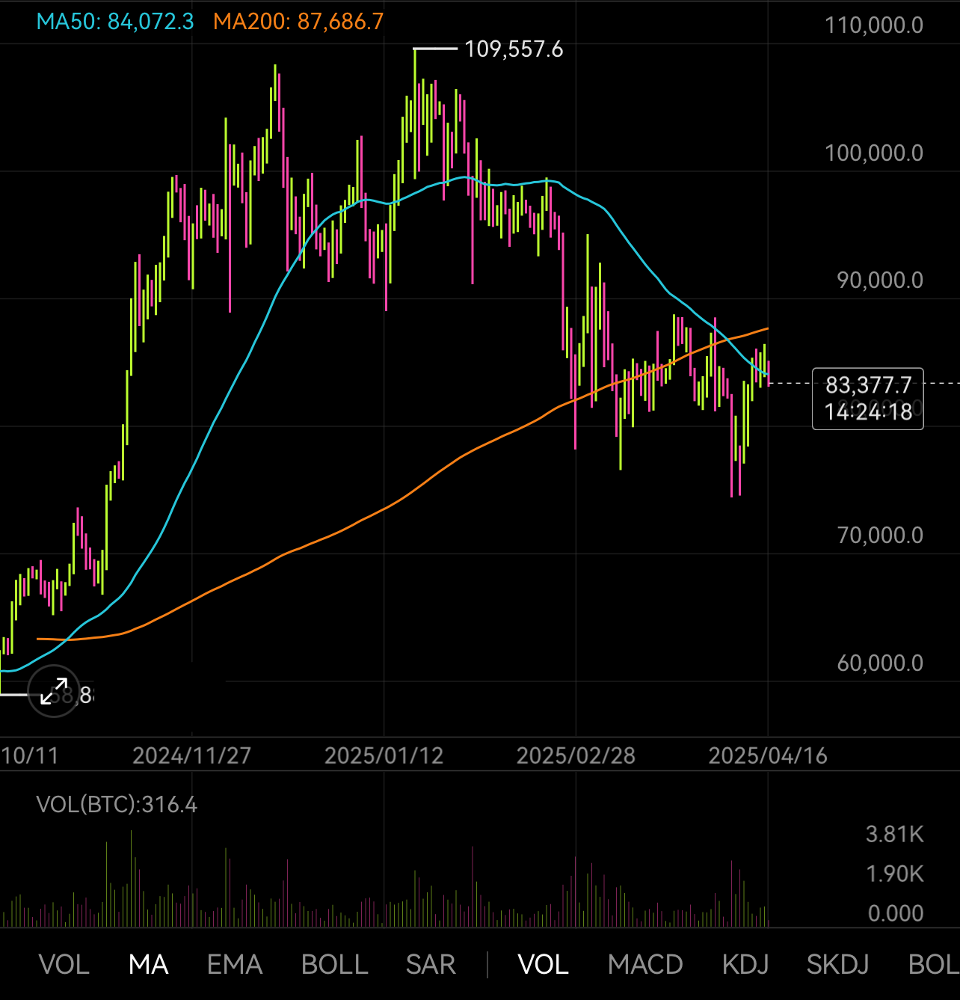
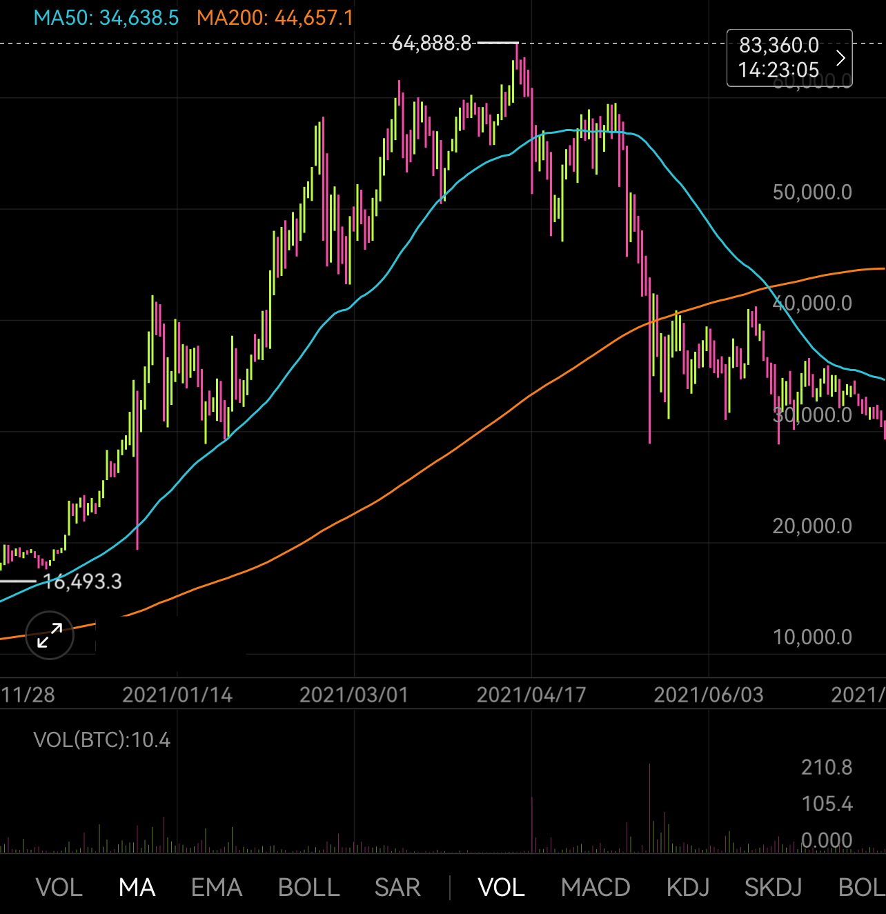
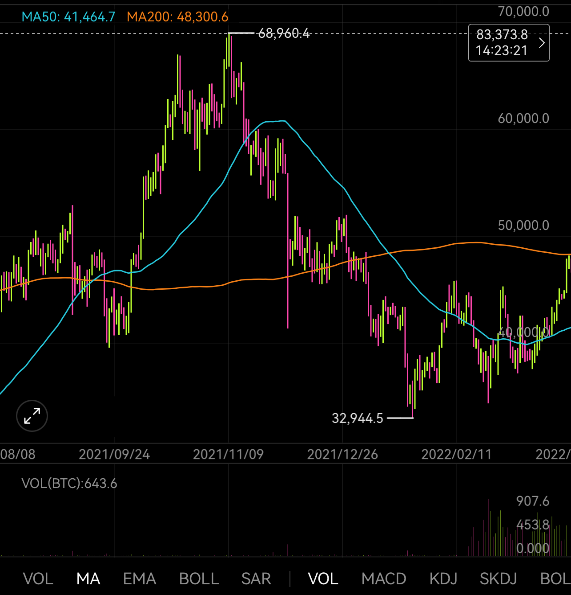

# 牛中熊初之迷思——以2021为鉴

隔夜BTC骤然掉头回踩30日均线83.4k支撑。目前市场极度低迷，BTC深陷死亡交叉泥潭（下图），目前围绕50日均线反复挣扎。于是不禁有一个迷思，目前究竟是牛市中期回调洗盘，还是熊市初期垂死挣扎呢？执两种观点的人都有很多，也都能摆出许多道理和依据出来，争执不下。

牛中洗盘的典型代表是2021年“519”崩盘之后三个月的死亡交叉洗盘（下图）。

对比一下就能很直观地看出，2021年中的牛中洗盘，下杀要狠得多。短短几天就从6万刀的高度杀到3万刀，直接腰斩。让人想起一句词：樯橹灰飞烟灭。

“519”下杀之后，200日均线就成了阻力位，成功阻挡了一切反弹的努力，不断消耗多头的力量，并逐步回补下杀插针的下影线，把多头摁在死亡交叉的阴影里反复摩擦。

从量能上看，多头几乎是毫无招架之力。无量下跌，招招致命。待到7月底，彻底回补下影线，几乎所有人都要绝望之际，BTC始料未及地绝地反击，走出了2021年底的下半场。

相比之下，目前2025年2月到现在4月的回调力度仅有20-30%左右。不过，这点儿力度，就已经足以杀穿200日均线，杀出死亡交叉了。

再来看一下2021年底至2022年初的熊初期市场表现（下图）。

彼时，BTC不仅是击穿200日均线，而且是再次回踩3万刀上方附近，给人一种“519”再现的错觉。

面对同样的死亡交叉，面对同样的3万刀，错过“519”后中期洗盘抄底的资金，就上钩了。半年前的“错过”，让他们懊悔不迭。他们的FOMO情绪，被2022年2月份之后突然急剧放大的成交量刻画的淋漓尽致。

当2022年3月底BTC再次摸到200日均线48.3k，眼看就要突破时，一个月来FOMO抄底的人，喜悦之情似无以言表。

可是现实给了他们重重一击。对第三浪牛市的翘首以盼，最终随着BTC到2022年5月份迅速跌破2万刀而化为泡影。在3-4万刀区间FOMO抄底的资金，也都被深度套牢。

这一套就是2年，直到2023年10月份BTC重新突破3万刀关键水平才得以解套。而在此期间，要经历2022年底跌至1.5万刀底部割肉、2023年6月回本止盈、2023年9月再次回本止盈的重重考验，才能拿到最后。

短期博弈，放量下跌，积极抄底，往往代表着多头捍卫阵地的决心。可是，放到长期趋势面前，任何人为努力都不敌形势，越是放量，多头越是积极抄底，却往往会过早耗尽弹药，让局势走向更加残酷的下跌。

就像跑短跑时，越能够把力量集中在瞬间爆发，效果越好。但是要是跑长跑，就要学会持久战，把力量均匀的分散到整个时间段，而不能一开始就过快加速，用力过猛，这样反而很快就会因为后劲不足而败下阵来。

可见，任何因素都要辩证的看待。积极的因素，也有其不利的方面。消极的因素，可能也有其有利的地方。
