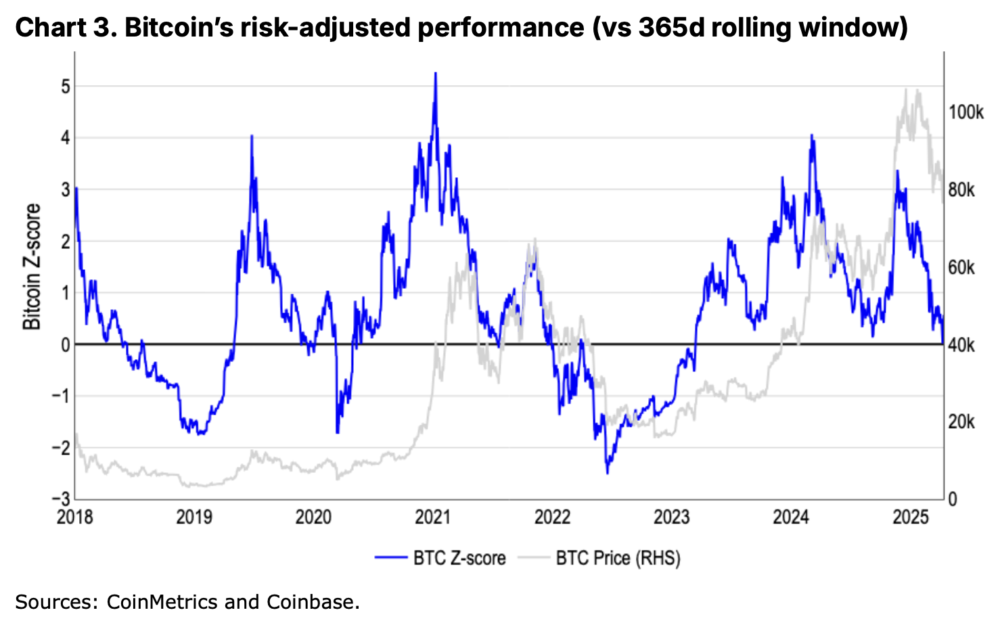
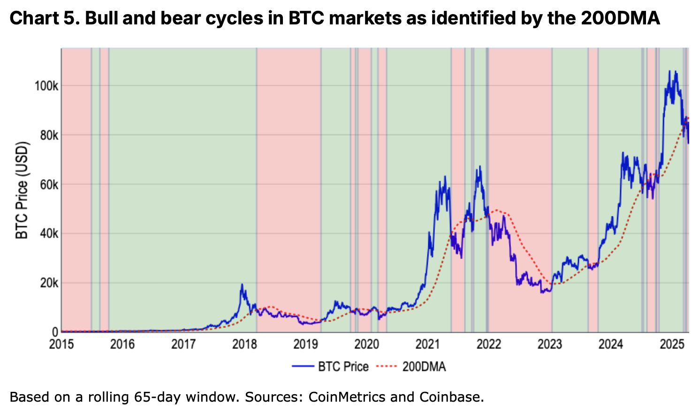
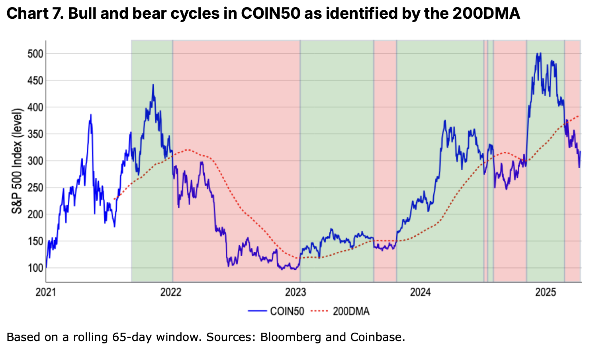

# 加密市场寒冬将至？

隔夜BTC在84k横盘整理。今4.17教链内参《乐观与悲观并存》提到，Coinbase研究院发布了一篇看熊初的报告。在这篇报告中，Coinbase研究团队对加密货币市场是否进入熊市进行了深入分析。报告原文链接在内参里。这里再谈一谈这篇报告的一些观点。

报告指出，比特币和COIN50指数近期双双跌破200日均线，这一技术指标通常被视为长期趋势转变的信号。与此同时，剔除比特币后的加密货币总市值已从2024年12月的1.6万亿美元高点下跌41%至9500亿美元，风险投资资金规模也比2021-2022年峰值减少50%-60%。这些数据共同指向市场可能正在步入新一轮“加密货币寒冬”。

报告首先探讨了如何定义加密货币市场的牛熊周期。

传统股票市场常用20%涨跌幅作为分界标准，但这一指标在波动性更高的加密市场显得不够适用。例如比特币曾在一周内下跌20%却仍处于长期上升趋势中。相比之下，200日均线（200DMA）被证明是更有效的判断工具——当价格持续运行在该均线下方且呈现下跌动能时，可视为熊市特征。

数据显示，比特币自2024年3月下旬开始符合这一标准，而涵盖前50大代币的COIN50指数更早在2月底就进入熊市区域。

市场疲软背后存在多重结构性压力。全球关税政策的实施与潜在升级加剧了负面情绪，传统风险资产在财政紧缩环境下持续承压，这种宏观不确定性直接传导至加密市场。尽管2025年一季度风险投资环比有所回升，但相比周期高点仍处于腰斩状态，导致山寨币领域尤其缺乏新资金注入。值得注意的是，比特币在此次调整中跌幅小于20%，但其他代币整体跌幅达41%，这种分化印证了山寨币具有更高的风险溢价特性。

报告通过风险调整后的绩效指标（z值）验证了当前趋势的严峻性。2021年11月至2022年11月期间，比特币价格下跌76%，相当于1.4个标准差波动，这与同期标普500指数22%跌幅（1.3个标准差）的风险调整后幅度相当。虽然这种量化方法能有效过滤市场噪音，但其信号往往存在滞后性。例如模型直到2月底才确认牛市结束，此后一直维持“中性”评级，未能及时反映3月的急跌。

历史数据揭示了熊市的本质特征。真正的市场结构转变往往伴随着流动性萎缩和基本面恶化，而非简单的价格百分比变动。2018-2019年加密货币寒冬、2020年疫情冲击以及2022年美联储加息周期等历史阶段，200日均线模型都准确捕捉到了趋势反转。当前环境下，市场深度收窄和防御性板块轮动等早期预警信号已经显现，这些现象在过往周期中都曾预示较大幅度的下跌。

Coinbase研究团队认为，虽然短期（未来4-6周）仍需保持防御姿态，但预计市场可能在2025年二季度中后期探明底部，为三季度复苏创造条件。

这一判断基于两个关键洞察：一是加密市场对情绪变化反应极其敏感，一旦转折出现往往呈现快速反转特征；二是当前监管环境的边际改善可能成为未来反弹的独特催化剂。不过报告也强调，在股票市场表现疲软的背景下，加密货币的独立上涨行情面临挑战。

随着加密货币生态持续扩展至Memecoin、DeFi、AI代理等新领域，单纯以比特币作为全市场风向标的做法已显局限。报告建议投资者需要建立更全面的评估框架，同时关注总市值、风险资金流向、技术指标等多维度数据。

研究团队自2022年以来的市场预测记录显示，其对周期性拐点的判断具有较高参考价值，例如准确预见了2023年一季度的反弹和2024年四季度的上涨行情。

这份报告最终传递出审慎但不悲观的核心观点。虽然技术指标和资金流向明确显示市场进入调整阶段，但加密资产特有的高波动性也意味着复苏可能快于传统市场。对于投资者而言，当前阶段更适合采取战术性配置策略，在控制整体风险敞口的同时，为潜在的市场情绪反转做好准备。

不过，所有分析都建立在现有数据基础上，而加密货币市场素以不可预知性著称，任何地缘政治变化或监管突破都可能迅速改写当前的市场叙事。
