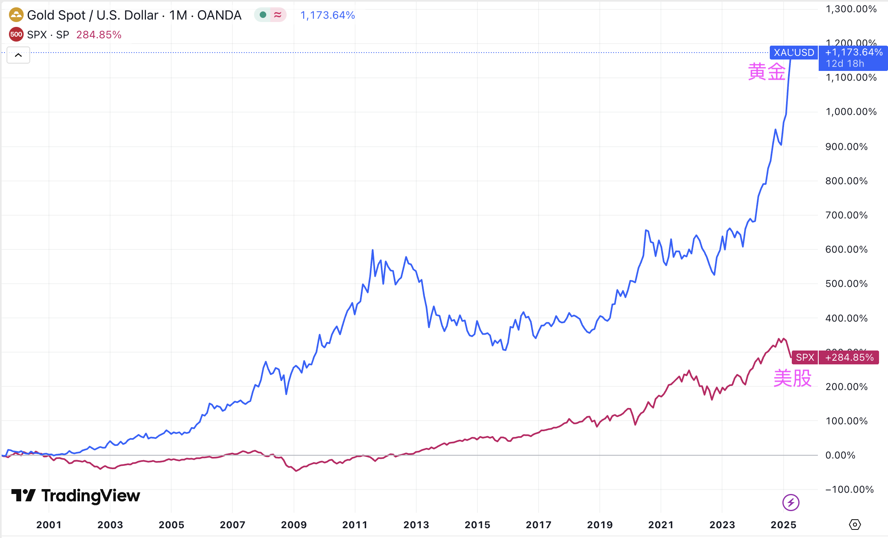
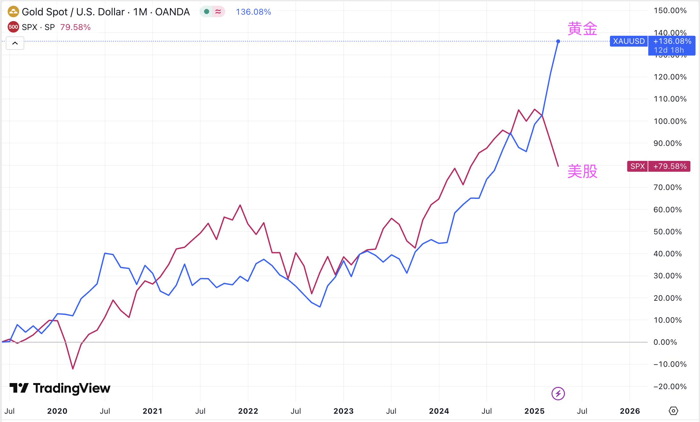

# 黄金跑赢美股

隔夜BTC于85k附近震荡。或曰近25年来，黄金跑赢美股。遂拉出2000-2025过去25年来黄金和标普500指数的增幅对比图，如下。

不看不知道，一看还真是吓一跳。近25年来，黄金涨幅超10倍，而同期标普500指数涨幅不到3倍。

念及于此，教链不禁又想起2020年写作《比特币史话》第40话大萧条一章时所写的话了：

「2019 年是人类第五次康波周期中衰退期转向萧条期的连接点。」

「在萧条期，对抗资产缩水的办法就是防御，从积极进取的资产（如股票）转为防守保值的资产（如黄金）。」

过去5年，黄金从1600刀涨到如今站上3300刀，而标普指数则从3000点涨到如今5300点。

数据背后隐藏着的，或许是一场悄无声息的货币革命。

桥水基金创始人达里奥（Ray Dalio）的洞察一针见血：这本质上是全球秩序重构的定价补偿。

在教链看来，货币的终极价值锚点是人们的共同信仰。

当美国在面对特里芬难题时知难而退，不愿意再继续维持美元出超，向全世界输出美元，并维持其世界货币地位时，全世界对灯塔的信仰就要土崩瓦解。而亲手摧毁这信仰的，不是别人，恰恰是美国自己。

人们正在步入全球信仰缺失的时代。

失序的时代。

秩序是昂贵的公共品。

二战后的世界，美国一手主导建立并供应这一公共品，并向全世界收取美元铸币税作为支付给该产品的价格。

当奉行保守主义的美国不再愿意为全球提供这一公共品时，旧秩序就要走向它的尽头。

黄金这种“原始货币”的强势回归正是这一洞见的明证。站在2025年回望，2000年互联网泡沫时期“黄金无用论”的喧嚣已成笑谈。当年嘲笑黄金不能生息的投资者不会想到，这个“原始资产”会在25年间跑赢美股。

黄金与美股的跷跷板效应在2025年变得愈发明显。当标普500从2月高点回撤8.9%时，黄金反而上涨12%突破2900美元，两者负相关性从常态的-0.12骤降至-0.30。这种背离折射出全球资本流动的转向。

世界黄金协会数据显示，2024年全球央行购金量达4975吨。这种集体行动就像银行挤兑的慢镜头：当美国国债规模突破37万亿美元，债务利息占财政支出比例突破18%，连最保守的央行都在用黄金对冲美债风险。

2000年至今，美联储资产负债表从5800亿美元膨胀到7.2万亿美元，期间经历了三轮QE和疫情后的无限量化宽松（俗称放水）。这种印钞速度让黄金的年化涨幅达到惊人的9.8%，而标普500算上股息再投资的年化回报仅为6.5%。

1971年美元与黄金脱钩后，美元对黄金贬值了98.6%，相当于黄金以每年5.4%的速度蚕食着纸币信用。这个速度在2020年后明显加快——过去五年黄金年化涨幅达15.6%，而标普500仅12%。

无论是3个月前BTC突破10万刀，还是如今黄金站上3300刀历史新高度，本质上都在诉说同一个叙事：

对法币购买力的信仰正在经历全球性的系统性塌方。

正如2008年中本聪所预见的那样。
