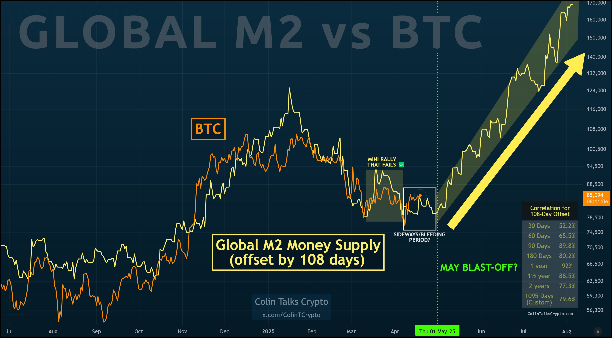

# 临门一脚：全球宏观流动性与BTC价格走势的相关性考验

周一BTC发力站上87k，详见4.21教链内参[《浮盈再次突破100亿美元》](/i/20250421)。下面这张图是一张关于全球货币供应量（M2）与BTC价格相关性的图表，教链在此前内参中曾多次提及。图中显示，全球宏观流动性（M2货币量）后移108天后，竟与BTC走势相当之吻合。这耐人寻味的同步性背后，究竟暗含着怎样的逻辑呢？

模型的核心逻辑是，全球宏观流动性究竟如何传导至BTC。

全球M2指标相当于各国央行印钞的总量，它反映着市场中的资金水位。当央行大量印钞时（如2020年疫情后的全球大放水），这些新增货币并不会立刻涌入BTC市场。图表中设置的108天滞后周期，试图捕捉资金从央行“放水”到流入加密市场的传导时间差。

数据显示，随着统计周期拉长，两者的相关性显著增强：30天的相关系数仅52%，而3年周期的相关性达到79.6%。这说明BTC价格与货币宽松的关联不是即时反应，而是一种中长期趋势的共振。当市场流动性持续宽松时，部分资金会逐渐渗透到BTC这类高风险资产中，但这个过程需要经历投资者信心修复、资金流动路径建立等环节。

而当图表右侧用黄色箭头指向“可能突破”时，暗含的逻辑是：若当前全球M2保持扩张（如日本央行持续宽松、美联储暂停加息），按照108天的传导周期推算，BTC可能在2025年5月份迎来新一轮资金驱动的上涨。这个时间节点刚巧和教链在2025.2.14文章[《破茧成蝶》](/a/20250214)中指出的节点暗合。

不过，模型也暴露出明显局限。2023年初的小规模反弹失败表明，单凭货币供应量无法完全解释短期波动。当时尽管全球M2仍在增长，但美国银行业危机导致资金暂时流向传统避险资产，BTC作为新兴资产反而遭遇流动性虹吸效应。这提醒我们，宏观流动性只是影响币价的必要条件，而非充分条件。

很显然，加密市场目前的体量规模，相比于全球流动性资产的规模还是太小了。

BTC在宏观流动性向加密市场的传导链中扮演着矛盾角色。一方面，其总量恒定的特性让它被部分投资者视为抗通胀工具，当法币贬值预期增强时，资金可能加速流入；另一方面，它仍是高风险资产，当市场出现流动性危机（如2020年3月疫情爆发初期），投资者会优先抛售BTC换取美元现金，导致其与风险资产同步下跌。

这种双重属性导致BTC与M2的关系呈现非线性特征。图中近三年79.6%的相关性数据，实际上经历了多次“背离-回归”的波动测试。例如2021年清退挖矿产业时，政策冲击短暂打断了货币宽松的传导效应，但当市场消化利空后，价格又重新向M2曲线靠拢。这说明模型的底层逻辑存在韧性，但具体传导过程会受到地缘政治、监管政策等外生变量干扰。

对于普通投资者而言，该模型的价值不在于预测具体涨跌，而在于建立宏观认知框架。当观察到主要经济体集体转向宽松时（如降息、量化宽松），可以将其视为BTC中长期向好的背景信号；而当全球央行收紧货币政策时，则需警惕流动性退潮带来的压力。图中1095天（约3年）的高相关性提示：用3年以上的周期视角观察，或许比追逐短期波动更有参考价值。

同时，我们还需警惕将相关性等同于因果性。BTC价格还受到减半周期、链上技术演进、机构参与度等多重因素影响。例如2024年的BTC减半事件，可能叠加全球M2增长形成双重助推效应，但也可能因监管政策变化产生抵消作用。因此，这个模型更适合作为分析市场的拼图之一，而非唯一决策依据。

从这张图表延伸思考，我们或许能更清晰地看到BTC在当代金融体系中的位置：它既是全球货币超发的产物，又是传统金融秩序的挑战者。108天的滞后效应，本质上揭示了资金从传统市场向加密世界迁徙的效率与阻力。当主流金融机构开始将BTC纳入资产配置时，这种传导周期可能会进一步缩短；而当黑天鹅事件爆发时，滞后期又可能被动延长。理解这种动态平衡，或许比单纯关注价格涨跌更有价值。
