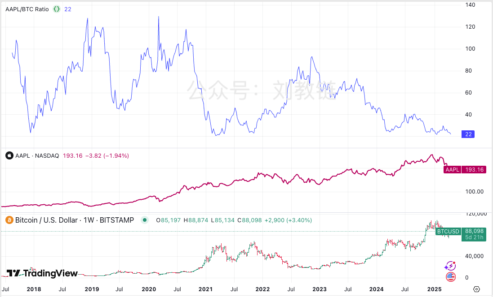

# 苹果和大饼

4.22教链内参《山寨持续低迷，以太汇率新低》报，隔夜BTC冲破88k，站上200日均线。最近一段时间，关于BTC市场目前究竟是见顶回落的熊初，还是牛市中期的回调，众说纷云，争论不休。教链看到一个有趣的比较，即把两种食物，苹果和大饼进行对比，用10000个苹果除以大饼，得到比率，绘制成图，即得苹果公司纳斯达克股价和BTC的比率变动曲线，如下图所示。

图中上半部分显示的，是从2017年底BTC牛市，到2021年BTC牛市，再到2024年底BTC突破10万刀至今的苹果大饼比率走势图。中间部分是苹果股价走势。下半部分就是BTC的价格走势。三个图都是线性坐标系。

由于苹果是纳斯达克指数的权重股，也是巴菲特持仓的第一重仓股，所以这个比率，也可以看作是代表了整个纳斯达克科技股市场和BTC的赛跑，或者是巴菲特老爷子和BTC的赛跑。

有趣的是，比率图的底部在近两轮周期（8年）间几乎是一条水平线。这意味着，一个加密投资的傻瓜，每次都买在BTC牛市最高点，拿到现在收益率也不输投资苹果股票，那基本上就意味着妥妥地跑赢纳指。

而如果稍微用一点儿什么定投、DCA、八字诀之类的策略，那就肯定是稳稳跑赢世界第一科技股苹果公司的股票。

比率线最高在2018年12月底熊市底部和2020年3月份“312”崩盘时刻都一度触及约130点。这时候大饼价格是苹果的1/130*10000 = 77倍。

而到了5年之后的现在，比率已经跌至22点，这意味着现在大饼价格已经是苹果股票的1/22*10000 = 454倍。

我们可以把BTC跑赢苹果看作是BTC相对于科技股存在隐含溢价率。

这个隐含溢价率在BTC熊市的时候会下降。比如2018年底熊市降到77倍；2022年底熊市降到107倍（2022年11月份，1/93*10000 = 107倍）。

而隐含溢价率在BTC牛市的时候会上升。但是从过去两轮周期来看，有个有趣的观察是，这个隐含溢价率似乎有个“天花板”，就是大约500倍（对应图中Y轴的20点）。

2017年底、2021年初、2021年底、2024年初、2024年底这几个时点，隐含溢价率在接近450-500这个区间的时候就开始反转。牛市见顶结束，熊市开始。

正是基于这一观察，有人就坚定地认为，2024年底、2025年初BTC突破10万刀，再次触及这一阻力位，也是本轮牛市周期第二次测试该阻力区间之后，就预示着本轮BTC牛市已经见顶，正式转入熊市了。

教链觉得，这一巧合，只不过是因为BTC恰好在最近两轮周期进入美股的市值区间，和美股联动较多罢了。

如果我们再向前看一下更早的两轮周期。

在2013年底的BTC牛市顶部，BTC约1163刀时，苹果约19.86刀，比率是19.86/1163*10000 = 170点，远高于神奇的阻力线20点。隐含溢价率是1/170*10000 = 59倍。

在2015年5月的BTC熊市底部，BTC跌至231刀时，苹果涨到33.14刀，比率是33.14/231*10000 = 1434点。隐含溢价率则暴降至1/1434*10000 = 7倍。

2011年中是第一次牛市。数据所限，只能最早回溯到2011年8月份，BTC约11刀，苹果约12.72刀，比率12.72/11*10000 = 11563点。隐含溢价率仅有1/11563*10000 = 0.86倍。

而到了2011年底熊市底部，BTC跌到2刀，苹果约为14刀，比率14/2*10000 = 70000点。隐含溢价率降至可怜的1/70000*10000 = 0.14倍。

这就是教链讲过的“相变”。

什么是相变？当水从固体变成液体，从液体变成气体，它的性质会变得很不一样。你不能拿液相水的性质（比如密度）去推断气相水的性质。

BTC从2009年诞生至2011年第一轮牛熊是一个相。第一相的存续时间是3年。

从2012年到2016年第二轮牛熊是一个相。第二相的存续时间是5年。

从2017年至今第三、四轮牛熊以及2024年至今所走的第五轮牛市是第三个相。第三相的存续时间目前已有8年。

从第一相到第二相发生了一次相变。隐含溢价率暴涨了50倍。

从第二相到第三相又发生了一次相变。隐含溢价率涨了大约10倍。

现在也许BTC正准备发生再一次相变，从“股相”（即体量和相关性等表现的更接近美股）变成“金相”（即体量和相关性表现的更接近黄金）。

相变的标志之一，就是上面最初的比率图线突破那个看不见的天花板，突破20点的阻力位，突破450-500倍的隐含溢价率阻力区间，彻底进入新的水平。

假设这次相变令隐含溢价率仅仅增长2倍。由简单的数学可以算出，牛市顶部隐含溢价率应达到1000倍左右，这意味着苹果大饼的价格比率将会是10点。

目前苹果股价大约是190美刀。10点对应的BTC价格是190/10*10000 = 19万美刀。

这个跷跷板也可以反过来。对于目前BTC约9万刀的价格，10点对应的苹果股价大约就会是90000*10/10000 = 90美刀。

因此这里有三种情况：或者BTC被低估了，或者苹果被高估了，或者相变不会发生，现在就是牛转熊的高点。

上面的计算采用了保守的隐含溢价率增长2倍的假设。因为50/5 = 10，10/5 = 2。

如果采取更加激进的假设呢，比如隐含溢价率将要相变为5倍如何？

那么上面的计算结果就会变成：2500倍（隐含溢价率），4点（价格比率），47.5万美刀（非低估大饼），36美刀（非高估苹果）。

十分有趣的是，按照原初的幂律模型，2025年底的幂律上轨高度就是大约50万美刀，和47.5万美刀非常接近。

我不知道大饼涨到40-50万美刀会发生什么事情，但是苹果跌到90美刀或更低大约是要死人的。
