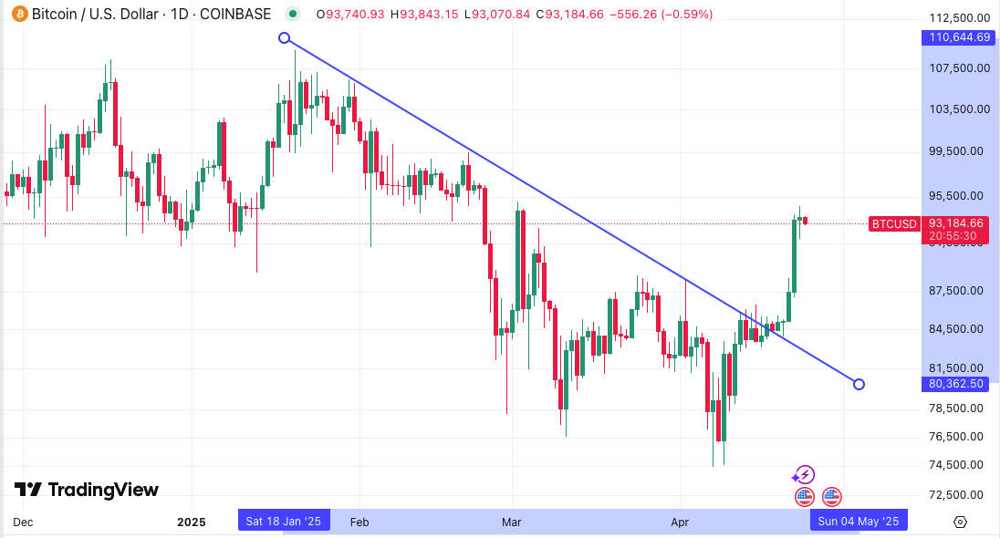
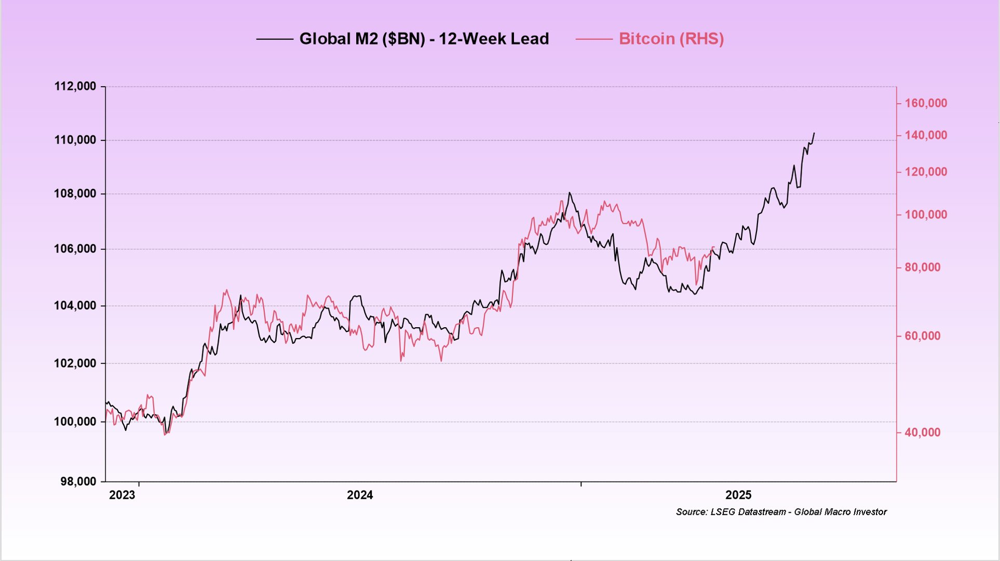
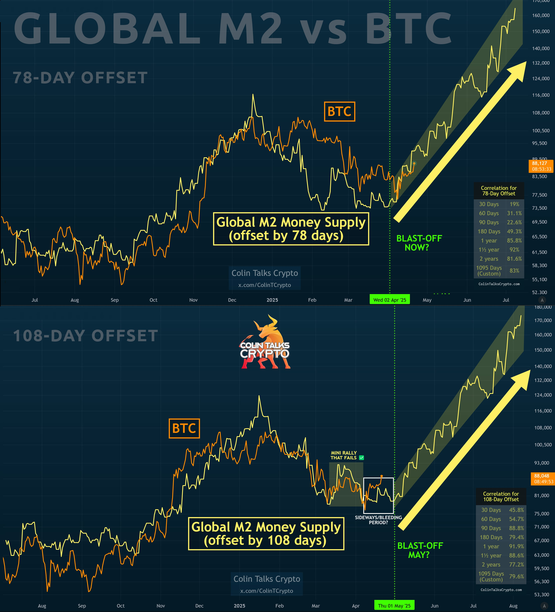
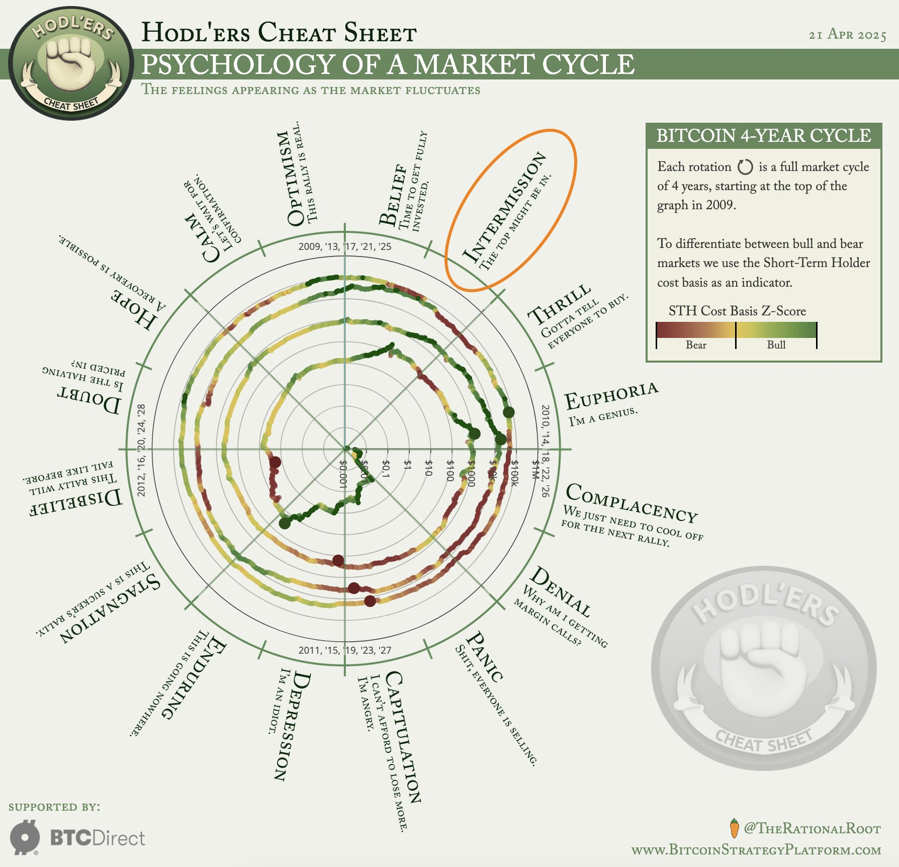
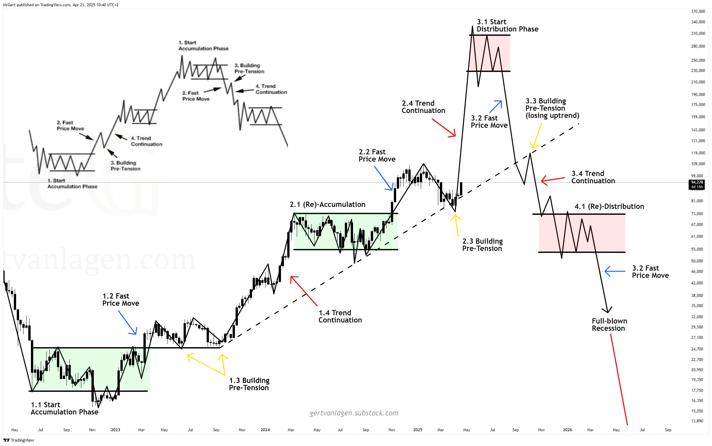

# BTC突破9万刀，诱多还是突破？

这两天BTC对84.5k横盘平静的打破，让市场骤然由看熊转为看牛。在不少人看来，这次强势拉升突破9万刀，是对三个月来下降通道的趋势打破。

宏观派把天天念叨的全球M2流动性图表再一次搬出来，指着图线说，看吧看吧，BTC和M2宏观流动性的走势不能说很接近，简直就是一模一样。

不过呢，其实如果你仔细看，还是会看到局部有小的背离现象。没关系，可以前后移动数据，调整到一个看起来更加严丝合缝的样子嘛。

反正，按图索骥总是令人心生宽慰。要么，我们已经度过了局部触底，开始回升；要么，我们很可能在5月初还要再目睹一次回测，而后一骑绝尘？

周期派则根据4年减半周期刻舟求剑，指出现在已经到开始牛市冲顶的时候了。

如果牛顶是泰山之巅，那么现在刚到中天门？

技术图形派则搬出了祖传秘方wyckoff积累模式，依样画葫芦指出，2022年底半年积累期，2024年3月突破前高后整理两个季度是第二积累期，目前2025年4月的回调是对支撑位的回测。

不过，教链不明白的是，2023年上涨途中多次回测支撑，现在2025年的看涨途中为何只需一次回测然后就要冲上去了吗？

对于未来，都是想象而已。

如果你能心算凯利公式 f = p - q / b，就很容易明白一个道理：胜率(p)决定仓位。赔率(b)再高，也不过是给胜率创造更大舞台的配角而已。

对于各种怀揣发财梦赌概率的操作，极低的胜率决定了，最佳的策略其实就是不参与，远远离开。

就像每当教链看到有人贴出什么几u本金赚到几千万u的帖子，总是无奈笑笑。拿到一万倍为胜，胜率几何？万一恐怕都没有。

一万乘以万一，不过是向一的回归。万一是肯定没有的，因为有人是肯定抽水稳赚的。于是就是向零的不归路。

回到BTC。

如果果然认真记账的话，不妨测试一下，BTC = 20万刀时，赚到多少；BTC = 5万刀时，又亏到多少。那不过是从10万刀起，翻倍和减半的概率。

而本轮20万刀的胜率又是多少？一千个人心中就有一千个哈姆雷特。

如果你心里觉得胜率只有8成，而赔率只有两倍，那么凯利算出的押注量就只有8 - 2/2 = 7成仓。
