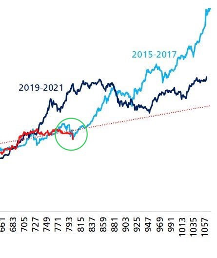

# 自由市场反共识

今日4.25教链内参《短期持有者回本止盈》提到，BTC经过多日连续反弹后目前已触及套牢盘深重的阻力区。

随着BTC再次突破9万刀，教链看到社交媒体上有KOL开始鼓吹5月大暴涨了，不知怎的，竟有些隐隐不安。

要说提前推断5月份这个关键节点，教链早在一两个月前就在文章和内参中多次提到。比如2025.3.13文章《币市熊出没》就写道，「教链直觉上感觉，现在的盘整，更像是2017年初首破前高后，持续三个月的震荡洗盘。那次洗到5月，这次也洗到5月？」

以及2025.3.13教链内参《以太坊的下一个大叙事》中也谈到，「分析师预计，财政部长将在5月5日前明确预算中立的BTC收购策略」，「嗯，5月释放个大利好，就开始下一波行情？2、3、4三个月盘整，洗一下盘。」

更早，在2025.2.14文章《破茧成蝶》中教链就复盘过2017年的走势。2017年也是从年初盘整到4月份，然后才开始起飞的。

但是，自由市场的真谛却不是共识，而是反共识。

当所谓的共识形成的时候，也就是它崩溃的时候。崩溃的原因，一是外部有收割者利用它进行收割，二是内部各怀鬼胎的聪明人开始抢跑互割。

自由市场存在的意义，本就是强化自由竞争，而要谨防利益同盟形成，攫取垄断地位后，剥削超额收益。

自由，本来就是刺破共识幻象的最锋利的刺。

BTC的共识之所以强大，不是因为它的自由，而恰恰是因为它的不自由：谁都不能擅自改变发行策略，即 sigma[0,32]{210k * 50/2^n}。强约束，无自由，这才诞生了最强共识。

所以每当我们听到山寨币、垃圾币的市场营销人员在直播间高喊“家人们，共识起来”的时候，懂行的人都不禁会在心底油然生出一种令人忍俊不禁的魔幻感。

话说回来，过去的这个4月，冷得真像个熊市。

教链深入一线，对冷暖温度的感觉十分真切。这个即将过去的4月，会员朋友的活跃数量直接腰斩，甚至不乏离场退圈之人。

相比于2024年的一路高歌猛进，2025年开年就是一记暴击。

那句江湖戏言言犹在耳：每当你想大干一场的时候，你就会被大干一场。

幸运的是，每每教链想大干一场的时候，都还能先自我冷静一下，不要过于上头，不要过快行动。

市场上的传声筒总是宣扬什么“唯快不破”，什么“遇到机会不果断出手，错过后悔一辈子”之类的格言。可是教链在市场中摸爬滚打这些年，却有着完全不同的体悟。那便是：宁可错过，不要做错。

嗯，也许你看到的每一篇激动人心的励志文，你听到的每一句令人上头的喊单声，都是镰刀炮制出来给韭菜家人们的“特供食品”吧！

为什么教链悟到的是全然相反的心得呢？为什么“宁可错过，不要做错”呢？

因为对于大部分韭菜而言，穷是最大的问题。因为穷，本金太少，所以不会有太多的试错机会。富二代亏光1个亿，自有千亿富豪老爸兜底捞他上岸。可是对于穷韭菜，做错一次的后果可能就是万劫不复，再也翻不了身。

所以教链总是讲，胜率为王。

那又为什么宁可错过呢？因为你要永远相信一点，未来永远有新的机会，甚至不乏更好的机会。

从来没有什么错过。

很简单：你相信儿子、孙子会过得比你更差吗？只要你相信世界在进步，那么未来只会越来越好，未来的机会只会越来越多，越来越大。

反之，如果你悲观到竟然不相信这世界会变得越来越好了，那么也许你根本就不该进入市场投资了。投资永远都是投资于更好的未来，这是投资的底层逻辑。连未来更好都不相信了，此刻应该做的最正确的事就应该是清仓离场，再也不回来。

既然选择待在市场中，就暗含了相信市场会变得更好的信心。既然相信市场会变得更好，那么就要相信未来机会只会更多、更好。既然相信未来机会会更多、更好，那么就不应该对此刻的可能的机会（也可能是陷阱）产生FOMO（害怕错过），从而做出不明智的行动。如此，才是逻辑一贯的。

这个逻辑简化成四个字就是：永不追涨。

所以教链在“八字诀”中总结的只会是，逢跌加仓。
