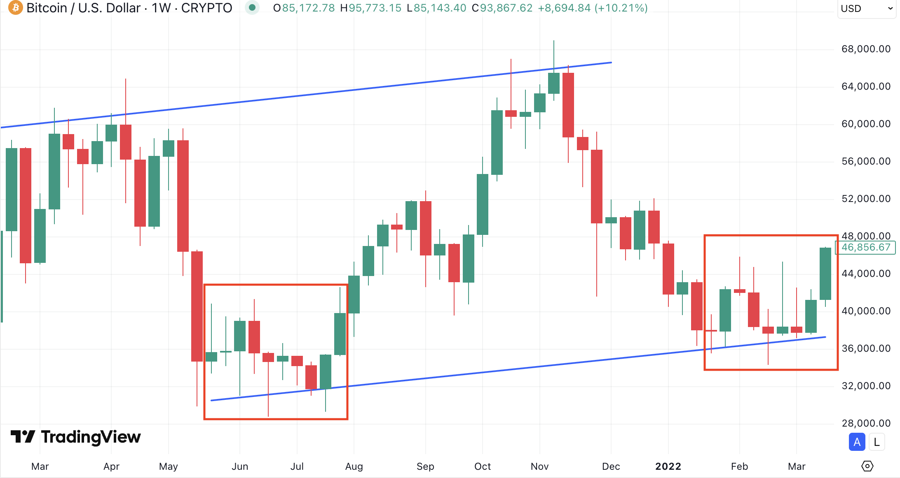

# 牛市不满仓

周末BTC在拉升后的94k一线横盘震荡，或蓄势待发，或摇摇欲坠。今4.27教链内参《第16周 宏观风险稍稍平静 大饼暴拉升破九万》对过去一周的市场动态做了一番回顾，并指出，此番从85k到95k的拉升，越过了关键的市场心态牛熊分水岭200日均线。

这不代表已经安全，也不代表岁月静好。再次跌破200日均线的阴云，仍然笼罩在市场的上空。

如果牛熊真的是靠一条200日均线就能定义，那事情就太简单了。但真实的市场却永远不是那么单纯。

比熊市给人的绝望更可怕的是，“这是回调、牛市还在”的幻想。比跌跌不休击碎幻想更害人的，是先反弹拉升诱多再砸盘收割。

2022年3月，随着LUNA“天才般”地换锚BTC战略储备支撑UST，二级市场大举吃进BTC，市场触底回升，盘面看上去美好的不得了，这是妥妥地要延续2021年以来的牛市稳步上行通道的样子。

可是，就在整个市场沉浸在牛市即将开启又一浪的美好幻想之中时，BTC开始无情地下跌。从2022年3月底到5月初，从一度反弹到接近50k急速下跌，再次击穿2021年“519”中场崩盘曾经击穿过的3万刀关键心理关口。

这一次，运气用完了。因为LUNA/UST的内在超发机制没有熔断设计，市场价格暴跌导致抵押物价值下跌，抵押物价值下跌导致被支撑的UST开始脱锚，USD脱锚触发自动超发LUNA回收UST的算法稳定机制，超发LUNA回收UST导致LUNA价格进一步下跌，LUNA进一步下跌导致抵押物价值继续下跌，…… 闭环了。死亡螺旋被启动了。命运的齿轮一旦开始转动，就迅速加速到了最高速度，奔向它宿命中早已写就的终点。

彼时彼刻，教链写了2022.5.13文章《LUNA/UST，币市绞肉机》。

LUNA/UST的闪电般崩溃绞杀了市场的流动性。BTC在接下来一个多月就从3万多刀迅速下跌，甚至跌破了2万刀（前高，即2017年牛市顶部）。

牛市不满仓。这和市面上理财大V大讲的满仓随牛市奔跑截然不同。

教链市场提及的八字诀，讲究的是动态满仓。BTC只进不出。没有增量资金时，就是满手BTC。有增量资金且尚未完投入，正在分批加仓时，则不是仅有BTC那种狭义的满仓。

与主观期待相反的，随着价格水平的急速升高，追涨进场拿到正收益结果的胜率就迅速降低了。

依据心中建立的凯利公式的思想，f = p - q / b，只要胜率p小于100%，仓位比例f就必定小于100%。

而越是熊市，越是满仓的良机。

熊市过后，必是牛市。熊市建仓后在牛市拿到正收益结果的胜率近乎100%，于是仓位比例就可以接近100%。

不要惧怕熊市中的下跌。哪怕如2020年“312”崩盘那样，短短几周从1万刀高度崩溃至击穿4千刀，回撤幅度一度高达60%，那也是逢跌加仓的良机。

熊市胜率高，牛市胜率低。所以，牛市不满仓。
