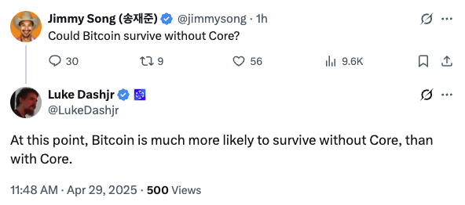
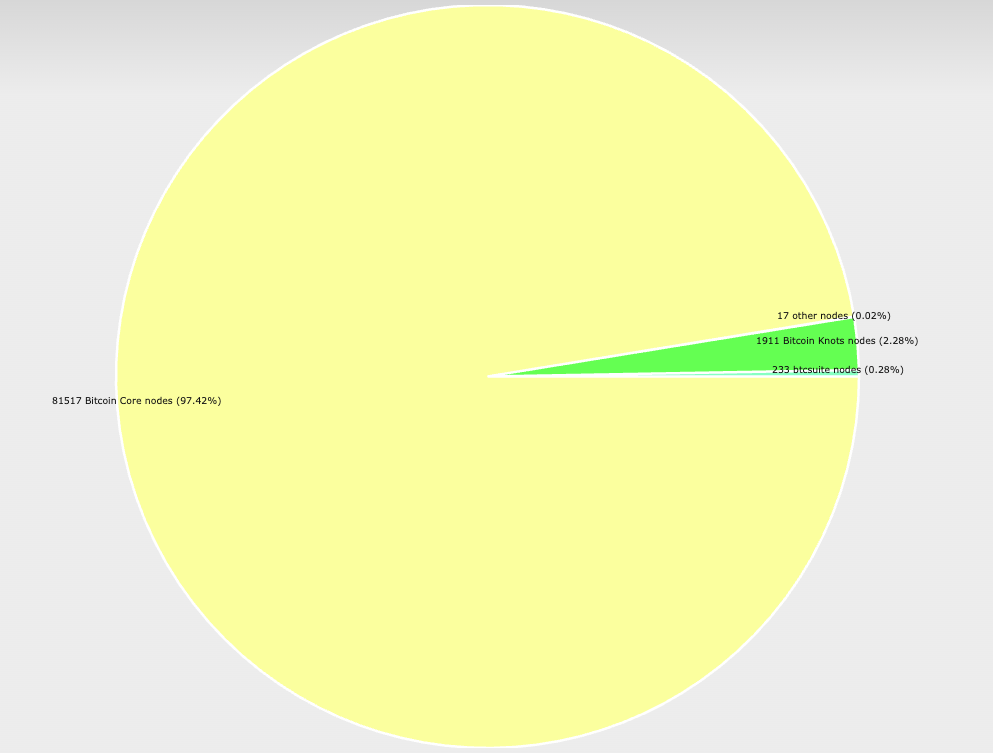

# 假如没了Core，比特币还能存活吗？

隔夜BTC回升至94-95k区间。比特币开发者Jimmy Song提出了一个发人深省的问题：比特币离开了Core（注：指Bitcoin Core客户端软件，被认为是继承自中本聪原始代码库的“正统”）还能存活吗？另一知名比特币开发者Luke Dashjr则回复：目前来看，比特币在没有Core的情况下继续存活的可能性，远高于依赖Core的情况。

众所周知，比特币自2009年诞生以来，其底层协议和运行机制始终围绕“去中心化”展开。作为其最初的参考实现，Bitcoin Core承担了维护协议规则、修复漏洞、升级网络等功能。然而，比特币的生存是否必须依赖Core？

从比特币的技术架构上讲，协议优先于实现。比特币的核心并非某一具体软件，而是由数学规则和密码学算法定义的协议。

Bitcoin Core作为协议的首个实现，提供了标准化的节点程序，但其代码并非不可替代。

理论上，任何符合比特币共识规则的客户端均可接入网络，只要新实现与现有网络的交易验证规则、区块生成逻辑兼容，比特币网络即可持续运行。

但是，根据Luke Dashjr的统计，目前Bitcoin Core客户端软件仍居绝对统治地位，市场占有率超过97%。

至于原因，教链觉得，可能是因为所谓大多数人的共识，需要一个载体。而选择一个最“正统”的代码库作为这个承载共识的载体，似乎是最简单的。

和矿工对最长链的选择类似，对Core软件的选择似乎也是博弈论里的一个“谢林点”（Schelling Point）。

这就是为什么比特币诞生16年，Core之外的其他客户端软件也有不少，但是它们却始终无法取得较高市场份额的原因。

而上图中占比第二位的Bitcoin Knots，其实也是Core，是Luke Dashjr个人出品的一个Core的魔改版本。

在比特币发展历史上，社区分歧最大的、最激烈的2017-2018年大小区块扩容之争的时候，大区块倡导者试图夺取Core的正统地位，一度动用了接近Core的算力，但最终还是败下阵来。这无疑大大加强了Core不可撼动的领导地位。

如果没有Core以及当时首席维护者Wladimir van der Laan（于2014-2022担任首席维护者）对原则的坚持和不懈地协调，很难想象社区纷争会激化到什么程度，以及是否会出现矿工集团反向控制开发团队，组建“军政府”的结果。

Core和矿工集团的区别在于，矿工集团掌握算力，一旦拿到代码修改权（立法权），那就是为所欲为，想怎么改规则，就怎么改规则；而Core想通过改代码来改规则，只能寄希望于社区自愿接纳新的代码规则，否则写了代码没人用，法令出不了github，就是废纸一张。

目前比特币的协议更新依赖于BIP（比特币改进提案）流程，任何开发者均可提交提案，但需经过矿工、节点、交易所等多方利益协调才能生效。Bitcoin Core代码库在GitHub上公开，全球开发者均可审查、修改或提出替代方案。

协议的演进机制本质上是一个社会实验。如果无法照顾到矿工群体的利益，则不可能成功升级。而如果无法照顾到更广泛的持币用户的利益，那么下场更惨，用户会用脚投票，抛售BTC，彻底将其抛弃，最终结局就是归零。

脱离Core的比特币可能面临两类风险。其一是协议碎片化。若多个客户端对规则解读产生分歧（如区块大小、脚本操作码），可能导致网络分裂。2017年的分叉潮已显示此类风险，但历史表明，市场通常会选择具有最强网络效应和稳定性的链作为“主链”。其二是开发资源分散。Core积累了十余年的技术债务和优化经验，新实现需重建同等水平的代码健壮性，这对社区协作效率提出更高要求。

不过，只要工作量证明机制、2100万上限、UTXO模型等核心规则不变，任何兼容性实现均可继承其价值存储属性。

如果在极端情况下Core消失，矿工为维护自身资产价值仍有动力切换到其他客户端，而交易所和钱包服务商也会适配新协议以保证业务连续性。

比特币的生命力根植于其协议层的社会共识与去中心化架构，而非特定开发团队或软件实现。Core的角色类似于“首席维护者”，但并非不可替代。

目前阶段Core的存在作为谢林点承载全球共识的“代笔”，其实是在替所有持币用户来书写比特币的规则，这是人类社会演化至今所能达到的自然而然的选择。

至于Core本身的“去中心化”，分裂成诸多客户端软件和代码维护团队，不再依靠传统协作方式进行协调，这实在是在人类还习惯于国家统治、公司治理等管理方式的时代，探索、开拓和创新出去中心化治理和自组织协作的崭新方式的又一座丰碑。

或许我们应当对此保持乐观。

历史危机证明，当代码缺陷威胁系统时，社区能够通过协作快速修复；当开发方向出现分歧时，市场通过算力投票选择主链。这种基于规则、动态平衡的治理模式，或许使得比特币即便脱离Core，仍可依托开源生态与全球参与者延续其网络效应。

也许其真正的生存底线在于：多数参与者是否依然相信数学规则而非人为权威，以及他们是否愿意为维护这一信念付出成本和代价。
