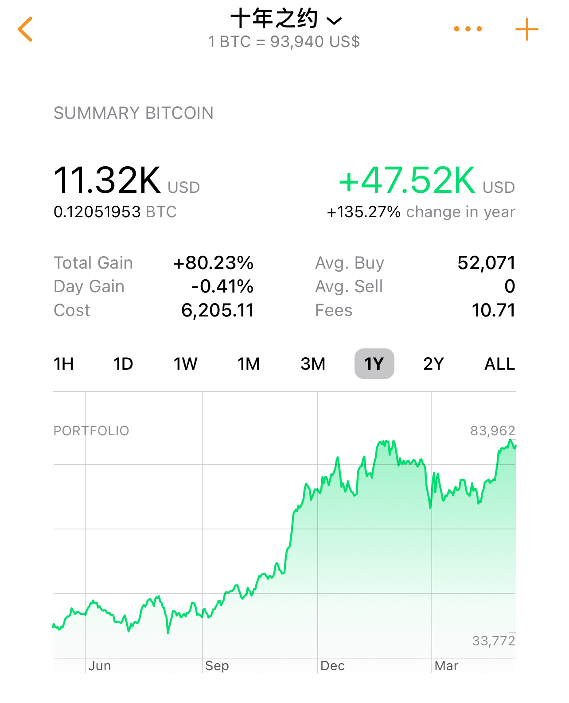

# 十年之约系列(46)：人生复利靠健康

五一假期结束。BTC回到94k下方，抹去假期涨幅。“十年之约”实盘见证计划来到第46篇笔记，因为5月1号的笔记“4月收涨不加”跳过了。这次是5月份的定投加仓，第33次加仓。本次加仓于93977刀。不知不觉间，这个计划已经坚持执行近两年了。本次加仓后持仓成本升至52542刀，目前持仓收益率78%。

可能是人至中年的缘故，这两年近的远的、圈内圈外陆陆续续有接触到各种生老病死的事。今天整理5.6内参《第17周 五一长假市场平淡 上攻失败抹去涨幅》的时候，看到巴菲特老爷子在伯克希尔年会上意外宣布年底退休的消息。不免感怀：也许离开，才是人生最后不变的乐章。

于是想到前些年老爷子的一生搭档，充满智慧的查理·芒格，在人生最后的岁月里，抄底某中概股，而后迅速止损割肉，为一生投资成功史留下了迷之污点。再后来，就听说芒格老爷子驾鹤西去了。巴菲特老爷子近年来趁着美股高点一直在各种减仓抛售，伯克希尔的现金持有量也屡创历史新高。就在大家都期待老爷子何时再次出手时，老爷子突然宣布退休了。也不知道是不是吸取了老搭档的教训，要保一个晚节。

巴菲特的财富，绝大部分是在60岁以后赚的。这一向是被当作复利神话的典型案例而为大家津津乐道。

但是，复利故事的背后，却还有一个常被忽视的隐含变量，那就是健康，或者更直白的说就是，你得有命活到够久。

太多人生悲剧，有命赚钱没命花。年轻时候玩命赚钱，年老时候花钱买命。

更悲剧的是，年轻时候消耗了身体，留下了健康隐患，却没赚到什么大钱；年纪大了病魔缠身，被各种医疗手段迅速掏空钱包。

于是就又有悲观者干脆说，猝死倒是一种无痛的解脱。毕竟，相比于人死了钱还在的悲伤，人没死钱没了也许是一种更加痛苦的人生。

看过太多过度积极医疗的案例，教链有时候就觉得，也许医疗的目标应该更多关注于患者未来预期生命时间中的总体生活质量，而不仅仅是治疗疾病。

平静地死去，有时候比痛苦地活着会更好。

无论如何，人生复利终止的那一刻，就是在彻底失去健康的时候。

从那一刻起，人生戛然而止。即使从生物学意义上还活着，从其他任何方面而言，都和死了无二致。

所以无论年轻还是不再年轻，都要时刻提醒自己：赚钱可以，玩命不行。

拥有健康虽然不能拥有一切，但是失去健康却会失去一切。

尤其是当你拥有长期复利的资产如BTC时，永远健康就是你最大的筹码。
