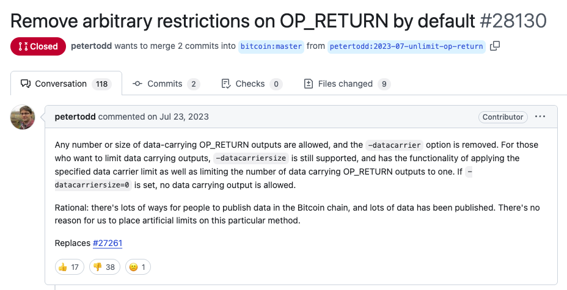
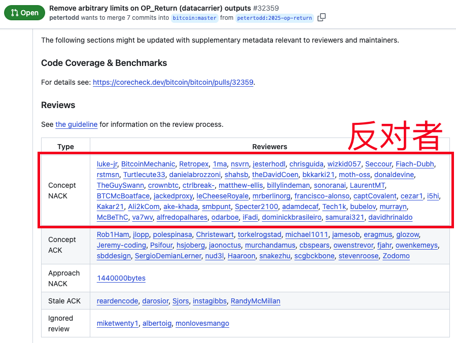
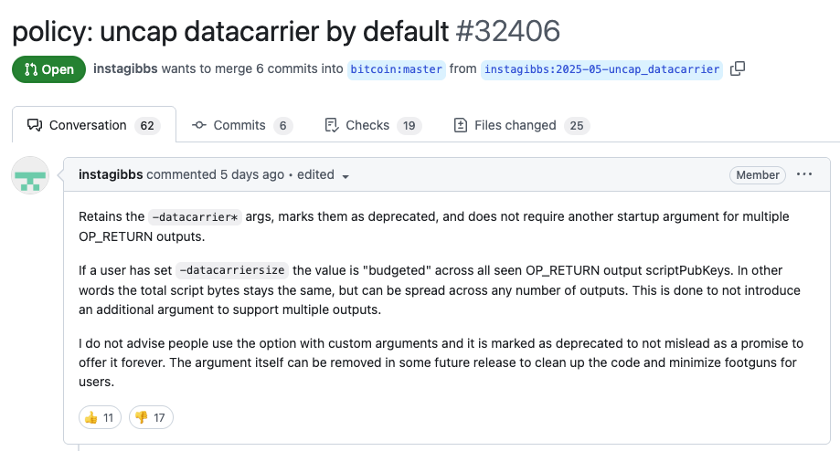
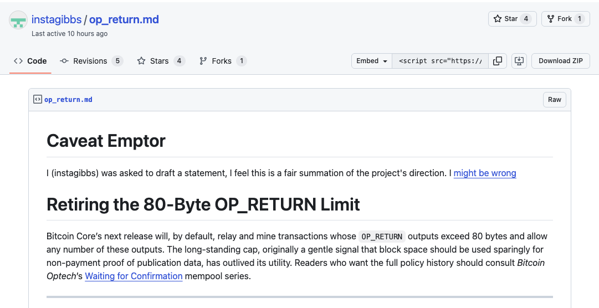
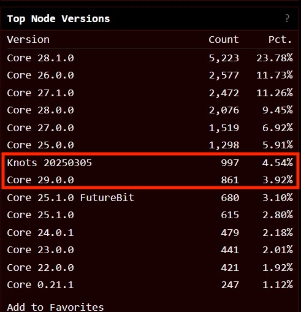

# OP_RETURN：最严重的BTC争议之一

隔夜今晨，美联储5月议息会议结束，结论见今早5.8教链内参《美联储不降息并继续缩表》。BTC短时回落后，迅速反弹上攻，剑指阻力位99k。

近日，一项关于移除Bitcoin Core客户端中对于OP_RETURN携带附加数据尺寸限制的提议在业内引起轩然大波。典型的推动者如开发者Peter Todd更是三番五次地提交PR（Pull Request），大有一番不达目的誓不罢休的意味。

2023年7月23号，Peter Todd就提交了PR#28130，提议移除OP_RETURN携带数据的限制。PR被关闭了，没有得到采纳。

2025年4月28号，他不死心，再次提交了相同内容的提议PR#32359。激进地要求不但移除附加数据限制，还要把配置选项删除，以免客户端软件用户自行使用选项打开限制。

提议得到了大多数人的反对。

另有开发者instagibbs，提出了另一个稍微温和一些的提议PR#32406。他提议暂时保留配置选项，但是默认不进行限制。

这个提议也是踩比赞多。instagibbs还为此写了一个说明，解释OP_RETURN的来历，以及为何要提议这样的变更。

典型的反对者如开发者Luke Dashjr。他是Bitcoin Knots客户端软件的维护者，也是两年前激烈反对铭文的人。具体可以回顾一下教链此前的有关文章。

对于普通读者，简单理解这个问题，教链可以做这样一个比喻：

解除附加数据限制 + 虚拟机执行附加数据 = 以太坊

当然，实际上并不是这么简单。比特币的账本是无状态的UTXO模型，要改造账本使之能够存储状态数据（进而带来新问题就是状态爆炸），才会接近以太坊的设计。

无论如何，当年就是因为Bitcoin Core拒绝Vitalik Buterin利用比特币账本的附加数据能力来实现他心目中的智能合约，才逼得他另立门户创立以太坊项目的。

而这轮周期迄今，押注以太坊跑赢BTC的人，心里想必都有不少草原动物呼啸奔驰而过。

由于这个能力只是客户端软件的一个功能，而不是比特币协议共识的一部分，所以不用担心这次争议会导致如2017年的那种硬分叉。

支持的主要理由包括如：有很多魔改客户端早就取消了这个限制，并得到了某些矿池的支持；也许可以给矿工带来更多的激励；限制OP_RETURN的能力，堵不住人们巧妙利用其他能力比如multisig、比如taproot script来携带数据，反而因为限制倒逼拆分拼接数据导致了UTXO的碎片化；堵不如疏，没有一刀切的方法可以精准识别什么是垃圾数据，这注定是一场徒劳无功的猫鼠游戏；等等。

反对的主要理由则包括如：放开数据限制将可能让比特币账本急速膨胀，从而削弱了去中心化；带来大量非金融应用，弱化了BTC的定位，使之沦落为支票簿；等等。

根据Clark Moddy Bitcoin的统计，目前比特币区块链的尺寸大约是748.1GB，其中OP_RETURN附加数据约为3.83GB，占比约0.5%。

目前还没有确切结论说相关PR会被合并和发布。不过，从社区用脚投票的结果看，现在采用瘦身版Bitcoin Knots的节点数量，已经超过了最新版本Bitcoin Core 29.0的节点数量。

也许我们将见证历史性的一幕：比特币作为一种共识，它其实并不必须依赖于单一的具有统治地位的客户端软件。（虽然这本就是一个事实，只是不为很多人意识到而已）

一个多元化的、拥有两至三种势均力敌的比特币客户端软件、代码库以及开发维护者团队相互抗衡的比特币生态，遵从一套比特币的共识，和而不同，斗而不破，是不是反而更能彰显比特币去中心化的魅力呢？
