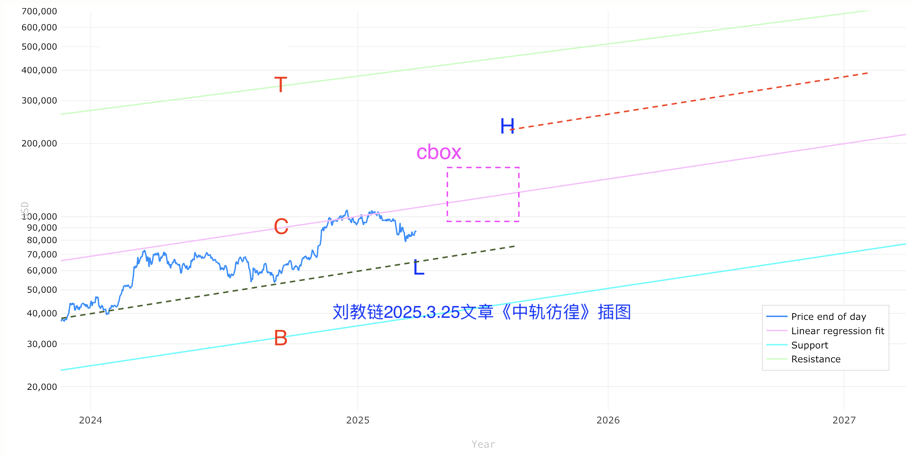

# 又见大饼十万刀

今天加密市场突然就爆发了。5.9教链内参《全面暴涨》记录，BTC强势突破10万刀，山寨也纷纷发力。ETH两日暴涨超20%，UNI最多拉升近30%，两根大阳线，千军万马又相见。

韭菜往往是记吃不记打的。以太虐他千百遍，他待以太如初恋。又或者，以太还是那个以太，而韭菜早已不是那一批韭菜了。正所谓，物是人非事事休，欲语泪先流。

没有什么会比一根大阳线更能说服人。如果有，那就是两根大阳线。昨天还在抱头痛哭，今天就开始互相敬酒了：满仓UNI，高！满仓以太，硬！满仓大饼，又高又硬！

4500跌到1500，跌去三分之二，眼泪早已哭干。1500反弹到2500，刚巧也是涨了三分之二，从ICU直接就进了KTV。跌了三分之二，又涨了三分之二，其实还亏44%呢。

45跌到5，跌去90%，精神早已麻木。5反弹到6，涨了20%，仿佛暗无天日的洞穴里透进来几缕阳光。跌掉90%，又涨20%，其实还在浮亏86%呢。

又见大饼十万，阳光照加密。
想问纯纯韭菜，又要冲啥币？
日线有诗情，月线有画意。
诗情画意虽然美丽，我心里只有你。

又见大饼十万，勾起我回忆。
愿那根根阳线，飞到你梦里。
模因讲暴富，山寨讲故事。
暴富故事虽然美丽，我信仰只是你。

分析师的摇唇鼓舌，市场上流传的消息，都滞后于价格的运动。价格，只有价格，才是改变趋势的动力。

教链3月17号文章《慢牛》里的图，如仿若2017，则5月开始突破，加速向上。

而3月25号教链文章《中轨彷徨》里的图，则对年中重返中轨进行了思考。

当时教链在文章中如此写道：“现在是直接起飞，直奔cbox的十万刀+呢；还是先蹲一波到低轨7万刀附近，然后再反弹升至cbox 10-15万刀呢？”

“要是按照「事不过三」的哲学智慧，把2024年1月视为「一测」（第一次测试低轨）、2024年9月视为「二测」的话，那么接下来，在冲进cbox之前，最好再来一个「三测」？”

竟一语成谶：BTC果真在4月初极限下探7万4，第三次测试低轨7万刀附近。而后开启三段爬升，4.10-4.12，三天从75k爬升到85k；4.21-4.25，五天从85k爬升到94k；5.6-5.9，三天从94k爬升到103k，强势突破重回10万刀上方。

年初震荡，5月突破。现在历史已经押韵。

后市呢？继续复刻2017年的下半场大突破吗？

教链3月17号文章《慢牛》里早早就做了估算：2017年从5月突破的水平1000刀，到年底顶部2万刀，是20倍。那么现在从突破水平10万刀起算呢？

原文如此写道：「从10万20倍，那得200万。似乎太高太高了。
10倍到100万。市值就要赶上黄金。
5倍到50万。市值大概可以到黄金的一半。十万亿，美刀。彻底脱离美股的市值区间。
2倍到20万。市值4万亿刀，力压美股第一。」

当然，市场也有可能和所有人开一个大大的玩笑：当所有人都觉得要复刻2017时，它却偏偏剑走偏锋，就是不按大家期望的来。教链把这种心理现象称之为逆反身性。

最近看CZ说这轮要到50-100万刀。不知道他说的这轮是不是2025年内呢？除非“大突破”真的发生，否则是不太可能的。2025年底的原始幂律上轨天花板也才50万刀。100万刀要看到2028年了。

教链心里还有一个反向的估算：50万刀跌80%，或者20万刀跌50%，那就还是重回十万刀。所以十万刀上方再追高，胜率就不高了。教链恐怕是不会在这里追高。

回想2021年牛市时，教链在年初牛市暴起时就画了止投线5万刀。很显然是被年初的快牛冲昏了头脑，才画了一个高出中轨18k（不到2万刀）一倍多、低轨运行到2025年底（5年）才能赶上的止投线。

而现在如果把止投线画在10万刀，那么仅相当于是2025年初的中轨高度，且低轨仅需运行到2028年初（3年）就可以赶上止投线。

或曰，就不怕错过10万刀的BTC吗？

教链想，也许相比于错过10万刀的BTC，追涨打光子弹以至于熊市无力逢跌加仓才是更值得未雨绸缪的问题吧？

风物长宜放眼量。至少，熊市的时候多想想牛市的准备，牛市的时候多想想熊市的问题，稍微深谋远虑一点点，在风起云涌的加密市场中冲浪会更游刃有余吧？
