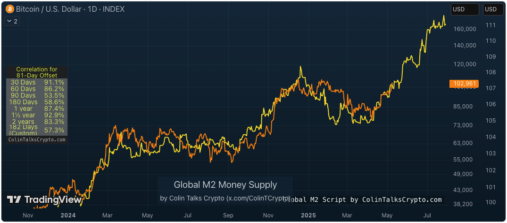

# 多维度视角

周一BTC在104k高位回调。今5.12内参《谨慎乐观》略谈一些交易心得，不提。收集了一些不同维度、不同角度的模型和看法，分享一二，或有启发。

首先是经典幂律模型。是不是正在发生周期衰减，等这轮牛市结束后也许就知道了。若果如此，模型就该要修正了。

也有人说，不要把它作为牛市指引，而应作为熊市支撑来看待。大致的哲学就是，不要试图预测和把握人们的疯狂，但是或许我们可以对BTC自身的反脆弱性有足够的信心。

宏观流动性（81天偏移）相关性。看起来好像是从2024年以来严丝合缝地引领了BTC的价格波动。但是质疑声认为，二者体量相差实在太大，难说这是真的相关，还是巧合。

黄金领涨BTC。在2017、2021两个过往周期，都发现黄金先启动，而后似乎发生了流动性溢出，BTC开始启动牛市行情。这和BTC领涨山寨实在有点儿异曲同工。这是说BTC是山寨版黄金的意思吗？（请注意这幅图是4月中旬也就是一个月以前的图，过去大半个月的拉升似乎印证了这个观点？）

RSI指标。似乎尚未见顶？但是这种纯技术指标都是从价格计算出来的，因而必然是滞后指标。很多时候不足为凭。

四年周期叠加云。不出意外的话，我们应该还有机会在2026年底左右见到7～10万刀的BTC？

威科夫积累派发模式。目前似乎是拉升中段，回踩测试支撑，然后走向最后一波？

周期分形图。接下来要开启的是“派发”阶段。从名字就能看出，这个阶段的正确动作也许是逢高减持，而不是傻傻地追高被套。可是如果所有人都聪明到待涨抛售，又有谁会当那个傻子去追高接盘呢？

四年周期（正弦波）。四年周期的来历是BTC产量减半的固定时钟周期。

螺旋时钟。这个也是固定四年周期理论。画成圆形更不容易观察和理解了。（下图是4月底的图）

展开成笛卡尔坐标系可能更容易看一些。下图是2023年底的图，现在我们已经走到了粉红色方块中。这个模型对牛市顶部和下一个深熊底部的估计似乎都是最悲观的。

大胆持有。谨防风险。
