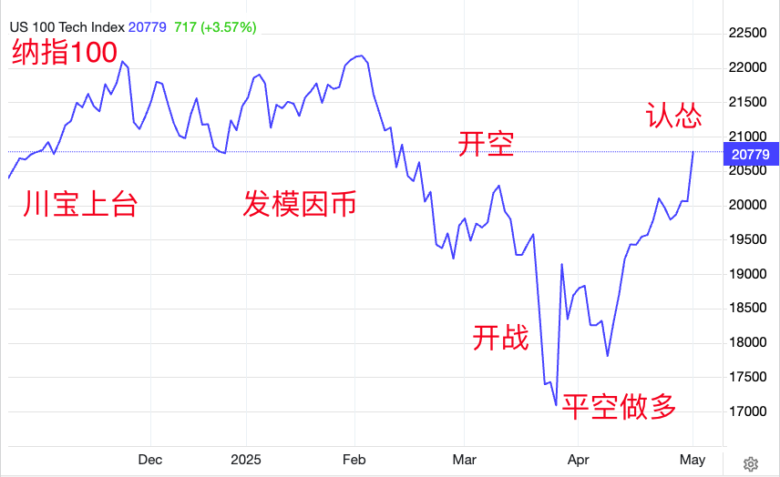
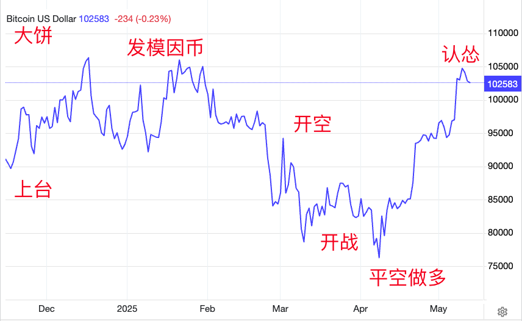

# 美国输了，川宝赢了

隔夜BTC回踩102k。南亚战场巴铁高质量打印，刷新了全世界的认知。中美瑞士磋商成果显著，周一联合声明揭示真相，完美契合了那句俗语，“一夜回到解放前”。今5.13内参《unichain的LP奖励活动再探究》报，双方均抹去近期新增关税幅度110%，「数字相当于一夜回到2025年4月2日所谓“解放日”之前的水平，标志着自4月2日至5月13日这一轮美方的极限关税施压完全失败。」

说起来老美这轮声势浩大、来势汹汹、面向全球的关税大战，才硬了一个月就怂了。怂得如此迅速，怂得如此彻底，怂得如此丝滑，真的快要赶上老印大规模出动三位数规模战机被秒揍的节奏，凑成一对活宝了。

就老美这种硬核撞墙满头包的样子，教链居然还看到有些简中大V舔老美屁屁，强行挽尊，说什么都减110%之后老美关税还是比老中高，乘以双方进口额，还是老美赚得多。这些家伙为啥那么阴阳怪气的总是能找到刁钻角度解释中输美赢呢，大概是因为重仓了美股（美元资产），屁股决定脑袋的缘故吧？

其实应当把老美作为一个国家，和总统川皇——现在怂了那就改口叫川宝——二元分立来看。这一波下来，老美可能是输了，但川宝确实是赢麻了——自己的家人、基金、朋友们利用金融市场的巨幅波动，早已赚的盆满钵满。

有人说川宝家族通过事前买入大量美股看跌期权，开启关税战砸盘，砸盘后空单获利。而后反手做多，再认怂投降，市场大涨，再赚一波。来回收割，疯狂敛财数百亿美元之巨。而其私密朋友们，如这个基金、那个基金什么的，则获利或达数千亿美元之巨。段子手说，股神巴菲特为何意外宣布年底退休？因为新晋股神已经闪亮登场，市场已经没有巴老爷子表演的舞台了。

请注意这些操盘都是川宝的儿子、女婿这些家人搞的。他们找到了素有世界最严监管之称的美股市场的致命漏洞：无论怎么违反证券法进行内幕交易获利，都可以用总统特赦令来进行赦免一切罪责。

不知道是不是受到上一任睡王特赦自己爱子的启发。至少，当上一任总统开了亲自动用特赦权赦免自己家人的先河，所有后续总统应该会对于“有权不用过期作废”再也没有什么道德负担了吧？

估计连老美的开国先贤们都想不到的是，如果未来真的上台一位把这种便宜行事的特权用在自家敛财致富的总统，这种制度性漏洞会不会成为一度被世人景仰的三权分立制度典范的千里之堤所毁于的蚁穴？

从哲学上讲，没有什么制度是完美的，毫无漏洞的，可以万世不易的。但是，建构在资产阶级唯心主义法哲学基础之上的西方民主制度，天生就有唯心主义的自恋病，即认为阶级高下是理所当然的、永恒不变的，以此为基础的治理制度也就是理所当然的，是最优秀和完美的，是“历史的终结”。

历史唯物主义从不这么认为。唯物主义认为，一切都是历史的产物，也必然会随着历史的发展而发展和改变。没有什么不是历史的洪流不能改变的。任何制度都不是完美的，都是生产力决定的生产关系的产物，必将也必须随着生产力的飞速进步而进化，否则就一定会被历史淘汰。实事求是，革新思想，而不是固步自封，保守反动，才是正确的态度。

这等不择手段的敛财，透支的是老美国家主权信用。落到抓手上，就是在透支美债和美元的信用。作为美元信用的对冲物，BTC已经从关税开战低点75k反弹回升到了年初10万刀的上方。

一来一回，看起来市场价格是回去了。但是很多韭菜的仓位却再也回不去了。这就叫做收割。赤裸裸的收割。

州官放火，明目张胆。

只是这市场，被收割了几百数千亿美刀，也即被掠夺了几百数千亿美刀的流动性，它又如何能在短时间内真正恢复元气呢？韭菜被齐根割掉之后，再长出来也是需要时间的呀！
