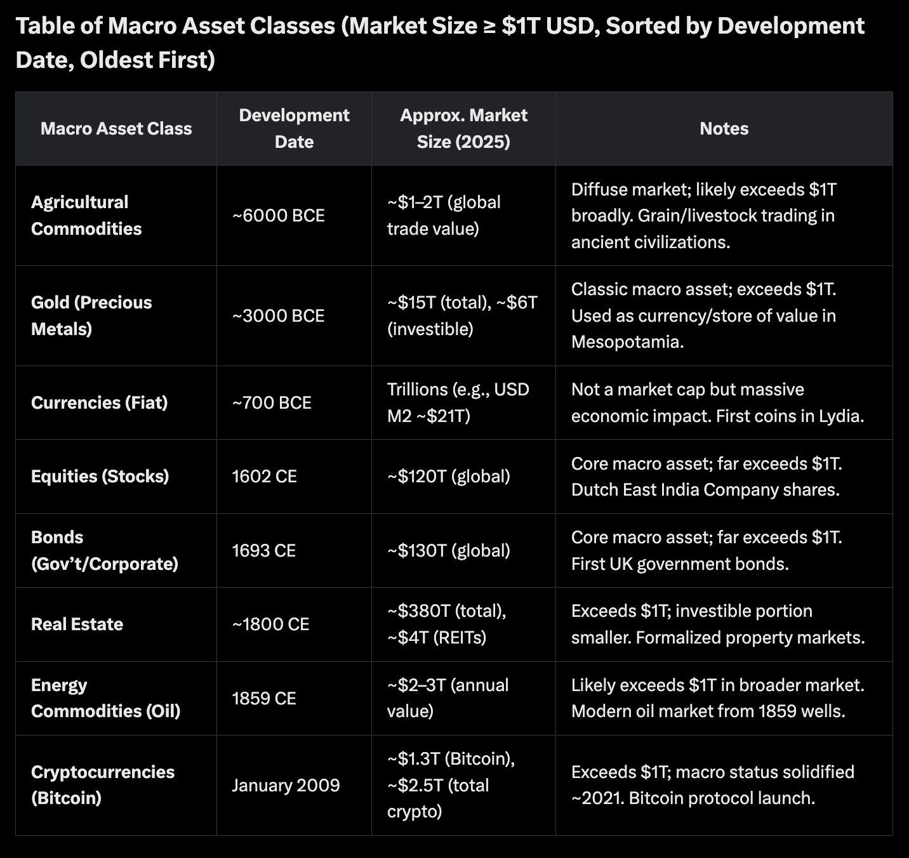
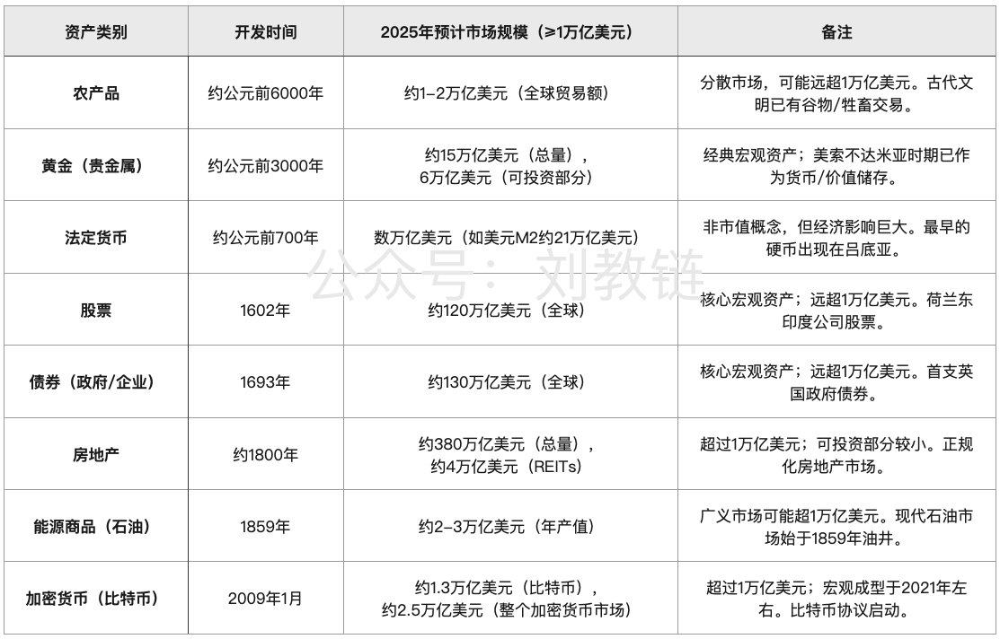

# 近150年来的一类新型宏观资产

BTC反弹至104k附近。5.14教链内参《美通胀率超预期降低》。

很多人可能还没有意识到，加密货币，尤其是BTC（比特币），已经成为近一个半世纪以来的一类新型宏观资产。

与人类历史上数千年来所开发、成型的其他数种超万亿美元的宏观资产相比，这一新型宏观资产类别还相当之年轻。

需要更新的是，现在BTC的市值已经增长到约2.1万亿美元，而整个加密市场总市值约增长到3.3万亿美元。

大量金融资本围绕各类型宏观资产展开部署。大量交易员每日紧盯这些市场。海量的信息和交易量日日翻滚，川流不息。

而新兴类别市场，总是充满着别样的巨大机会。越早意识到这一未来趋势，越早投入其中的人，越有可能获得远超后知后觉者的回报。

当我们将视线投向历史长河，农业文明用八千年时间将粮食交易编织成全球网络，贵金属用五千年构建起跨越文明的信用体系，法币用两千七百年渗透进人类社会的每个毛孔。

这些资产类别的成长周期动辄以千年计，而加密货币仅用15、6年时间就完成了从代码实验到万亿美元资产的蜕变。

区块链技术带来的价值传输革命，正在以更快的速度重构资产形态——BTC从2009年创世区块到突破万亿美元市值用了12年，而传统股票市场达到同等规模耗费了四个世纪。

加密市场从零到3万亿美元仅用了短短15、6年，这背后是数字技术对金融基础设施的根本性改造。

当更多主权基金和上市公司将加密货币纳入资产负债表，这种新型资产正逐步获得与传统资产平等的配置地位。

贝莱德的BTC ETF规模在2025年初达到500多亿美元，超过其黄金ETF管理总规模。

在2025年美元指数波动加剧的背景下，BTC与黄金的相关性系数大幅升高。尼日利亚、土耳其等通胀高企的经济体，其加密交易量连续保持高速增长。BTC这种非主权资产的避险属性，正在经济动荡地区显现出替代黄金的潜力。

站在2025年回望，加密货币的崛起轨迹与1870年代的铁路股票、1920年代的汽车债券、1990年代的科技股权有着惊人相似——都是技术革命催生的新型资产形态，都在争议中重塑金融版图。

不同的是，区块链技术赋予资产的不仅是所有权凭证，更是价值传输的基础协议。当这个协议层与人工智能、物联网等其他技术相结合，将可能会孕育出比旧有宏观资产更庞大的价值载体。
