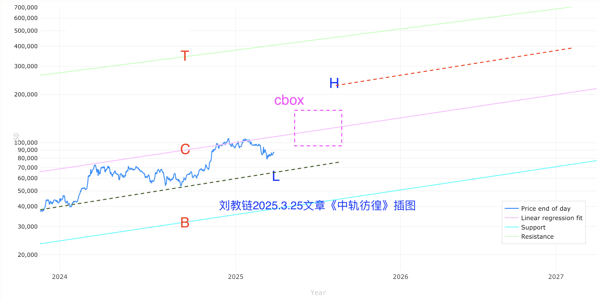
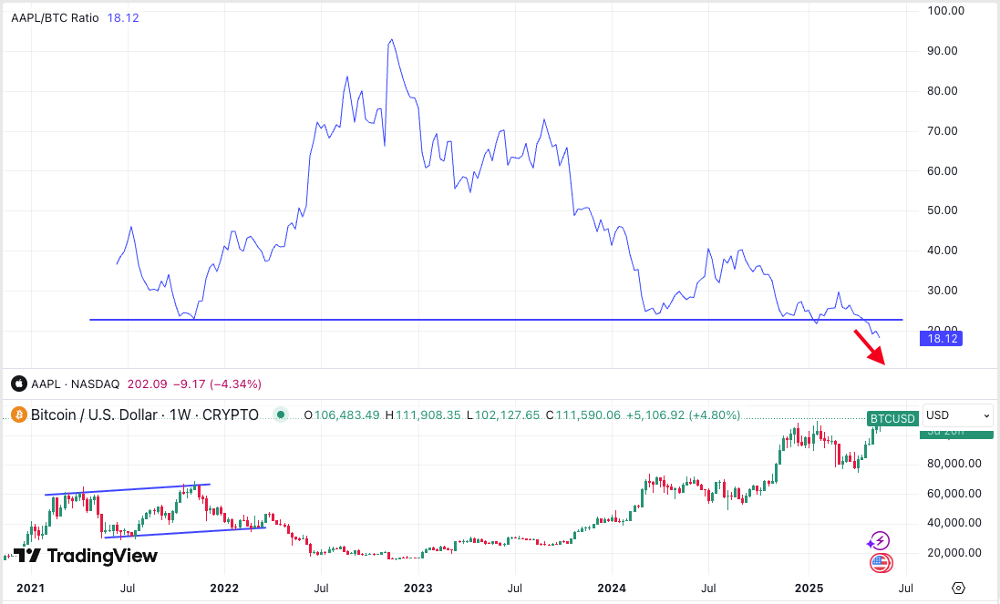

# 如今大饼又新高

BTC 111k。今儿5.22教链内参《BTC站上110k》写，BTC怒发冲冠。怒发冲冠，历史新高。过了新高，忽然没了套牢筹码的阻力，于是便骤然加速上行。

怒发冲冠，凭栏处、潇潇雨歇。
抬望眼，仰天长啸，壮怀激烈。
三十功名尘与土，八千里路云和月。
莫等闲、白了少年头，空悲切！

回首看，不久前，3月初至4月中，一个半月，BTC撤回30周均线，8万刀以下，竟成再次启动冲击新高前最后逢跌加仓的机会。

教链在2025.3.25文章《中轨彷徨》中，画了下面这张图。现实走法已验证，先回踩L线，然后反抽冲向cbox 10-15万刀。

如今大饼又新高。

8万刀附近卖的put，75k附近冲的市价单，如今都已茁壮成长。从75-80k到111k，浮盈40%左右。

而84k附近的彷徨，94k附近的犹豫，103k附近的恐高，都成了大饼冲刺新高一路上的“燃料”。

很显然，随着大饼重返新高，它也在继续打碎某些投资专业人士的看似雄辩的看空观点。典型的例子就是教链曾在2025.4.22文章《苹果和大饼》中介绍过的纳斯达克AAPL和大饼BTC的比价“底线”水平（如下图）。

这个案例之所以典型，是因为它在美股圈子流传甚广。根据这个所谓的经验指标，大量美股圈子的投资者都会选择在2025年初大饼首摸10万刀新高时抛售清仓。因为根据这个图中所展示的“铁一般的事实”，这时候大饼就应该见顶回落，开启熊市了。

教链看到有不少股圈大V，非常大聪明地公开宣称在2025年上半年逐步清仓。可惜的是，他们清仓砸盘的力量终究是有限的，只获得了3、4月份局部回调的短暂快乐，然后就笑不出来了。

为什么这个AAPL/BTC指标如此有穿透力呢？因为它聪明地选择了美股最有影响力的个股之一苹果公司，也是巴菲特的第一重仓股，作为参照物，这就使得该指标相比于其他币圈人自娱自乐的指标，对于美股圈子而言更容易打动人心。毕竟，炒股尤其是炒美股的，可能不知道中本聪，但哪个不知道巴菲特呢？

这个沉痛的教训告诉我们，任何指标都是不靠谱的。经验指标就是用来被打破的。

不过，教链虽未抛售，但也没有满仓。因为没有追涨，进入止投状态了。积累子弹，以待时机。

很多人总是在暴跌直指7万刀时畏畏缩缩，不敢出手逢跌加仓；而在暴涨冲破11万刀时又害怕错过，慌张追涨高位接盘。心态如此不稳，是不行的。

别忘了，90天暂停是2025.5.13文章《美国输了，川宝赢了》里面说的。90天是3个月。为操盘手做多挤出来的3个月。
