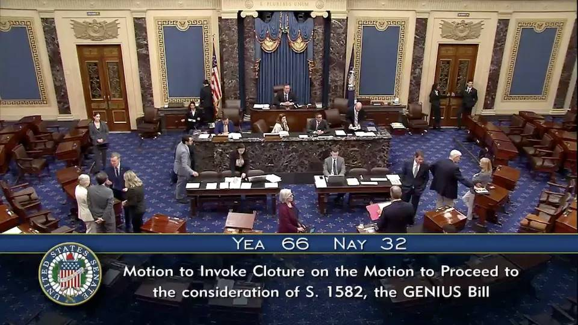

# 美元稳定币法案真的是天才法案吗？

日前，加密圈有一件大事，那就是美国参议院以 66 票对 32 票，通过了所谓美元稳定币法案程序性动议，进入联邦立法阶段。

这个法案，全称《引导和建立美元稳定币的国家创新法案》，英文首字母缩写恰好是GENIUS（天才），故得昵称“天才法案”。

一时间世界金融圈和财经圈纷纷热议，这个所谓的天才法案，究竟是美元美债体系总崩溃前最后的挣扎，还是果然天才般地化解美债危局，并助力美元霸权升级为3.0版本？

众所周知，最初的美元不过是黄金的代金券。美国靠二战打出来了美元霸权1.0的地位。黄金美元作为整个战后世界秩序的一部分，由布雷顿森林体系、世界银行、国际货币金融组织等体系和机构固定下来。布雷顿森林体系规定，美元和黄金以固定汇率挂钩，全球其他各国法币与美元挂钩。（参考阅读刘教链《比特币史话》第十章第42话）

但是，战后仅仅过了25年，美国就无力维持美元黄金的锚定了。美国经济学家罗伯特·特里芬（Robert Triffin）发现，美元要成为国际货币，就需要美国持续对外输出美元，而由于美元和黄金挂钩，输出美元就是输出黄金，这就势必导致美国黄金储备减少，不能支撑越发越多的美元，从而必然脱锚。

具体的，以下三个目标是无法同时达成的“不可能三角”：第一，美国国际收支保持顺差，美元对外价值稳定；第二，美国保持黄金储备充足；第三，美元价值可以维持在 35 美元/盎司黄金的稳定水平。这三个目标是不可能同时达到的“不可能三角”。（参考刘教链《比特币史话》第十章第42话）

这个先天的bug又被称为“特里芬难题”（Triffin Dilemma）。

当1971年尼克松总统突然在电视讲话中对全世界单方面撕毁协定，宣布美元不再挂钩黄金时，宣告了美元霸权1.0已经陷入崩溃危机。失去了黄金的支撑，美元价值摇摇欲坠。

天将降大任于斯人也。1973年，基辛格成为尼克松总统的国务卿。他提出“石油美元”战略。他说服尼克松总统在赎罪日战争（第4次阿以战争）中全力支持以色列。在美国强大的武力威压之下，沙特与美国秘密达成“石油-美元-美债”捆绑的关键协议：（参考阅读刘教链2024.6.9文章《每位比特币人都终将成为一个国际主义者》）

一、沙特石油仅以美元计价和结算，其他国家购买石油需储备美元。
二、沙特将石油收入盈余投资美国国债，形成美元回流机制。

很多人都被“石油美元”这个词语的表面意思给迷惑了，便说美元2.0是从黄金换锚到了石油。货币能买到的东西从来都不是货币的锚。货币的锚是那个约束和支撑货币发行的东西。

从商品生产的视角看，石油美元的资本过程是：石油 -> 美元 -> 美债。

而从资本运动的视角看，这个过程则变成了纯粹的资本增殖过程：美元 -> 美债 -> 美元'。石油生产，不过是资本运动过程的副产物。

当上世纪80年代末中国开始改革开放以后，美元美债的资本运动同样被套用在驱动中国制造生产大量工业品上面，取得了惊人的结果。对于这个资本循环而言，副产物是石油，还是工业品，其实都无所谓。金融资本要的只是高速循环中源源不断榨取的利润。

现在美国再也不用怕输出美元了。以前输出美元就是输出黄金，而美国又不掌握炼金术，没法子凭空变出黄金，很快黄金库存就要被掏空。现在好了，大肆输出美元不过就是输出美债，而美债说白了就是美国财政部打的白条，那还不是想印多少就印多少？

这就是美元霸权2.0时代。从上世纪70年代到本世纪20年代，大约45年左右。这个阶段的美元，与其说是什么石油美元或者什么别的美元，其实本质上是债务美元，也就是白条美元。

债务美元的重中之重在于，要把美元牢牢锚定在美债上。要做到这一点有两个前提：

第一，美债的发行、付息、交易等各方面都要做到全球第一，有最强的纪律，最可靠的机制，最有信用的偿付，最强的流动性等等。
第二，美国要拥有全球第一的军事威慑力量，迫使手里赚到大量美元的国家都要积极主动地购买美债。

为此，美元2.0的体系设计成一个分权制衡的双螺旋结构：财政部根据国会批准的债务上限“有纪律地”发债，但不能直接发行美元；美联储负责货币政策，发行美元，并通过公开市场交易美债实现利率调控。

但是，美元2.0虽然解决了黄金缺乏的问题，但是却引入了一个更大的bug，那就是任何人为的约束最终都无法真正约束住印钞的欲望。国会批准并不是一个不可逾越的障碍。美元自此走上了一发不可收拾的无限债务扩张之路，并在短短几十年时间膨胀到了36万亿美元之巨。

当2020年阿拉斯加一别两宽之后，整个美元2.0体系的天都要塌了。无他，因为中国拍桌子了。

巨量的美债就如同一副高耸入云端的多米诺骨牌，最下面就是几张小小的骨牌支撑着整个摇摇欲坠的庞然大物。任何足够引发震动的动作都有可能引发上面的塌方。

即便是没有外部震动，如此庞大的美债规模，也慢慢无法继续滚动下去，而陷入迟早崩溃的预期之中了。

于是，天才般的解决方案横空出世。这就是正在孕育之中的美元霸权3.0 —— 美元稳定币。我们似乎也不妨称之为区块链美元，或者加密美元。

不得不说，美国玩金融创新还是遥遥领先的。显而易见地，如果链上美元即美元稳定币战略大获成功的话，我们或将在不久的未来看到以下五个惊天巨变：

一、美联储垄断的美元发钞权被解构。美元稳定币成为“新美元”，而这些“新美元”的发钞权分散掌握在许许多多的稳定币发行商手中。
二、美联储资产负债表中的美债资产被消化。美元稳定币的发行商们会像鲨鱼争食一般抢夺美债，作为支撑美元稳定币发行的法定储备。
三、随着越来越多的传统美元资产通过RWA（现实世界资产）或其他名义映射为区块链上的代币（token），大量RWA资产加上加密原生资产（比如BTC）的天量交易将对美元稳定币产生巨大的需求，从而拉动美元稳定币的规模井喷式发展。
四、随着“RWA资产-美元稳定币”的交易规模井喷式发展，“传统资产-美元”的交易规模逐渐被超越，沦为明日黄花。
五、当美元在资产交易中的媒介作用日渐式微，沦为“美债-美元-美元稳定币”闭环中的附庸。

传统的美债美元发行机制为：财政部向市场发行美债，吸收美元。美联储发行美元，从市场中购入美债。如此实现隔空联动，用美债支撑美元的发行。

而美元稳定币的发行机制为：稳定币发行商接收客户的美元，在区块链上发行美元稳定币。然后，稳定币发行商用接收到的美元向市场中购入美债。

让我们用半定量的数字假设来推导一下。

传统方式：美联储增发1亿美元，从市场中购入价值1亿美元的美债，向市场注入1亿美元的流动性。财政部向市场发行价值1亿美元的美债，吸收1亿美元流动性。

问题在于：如果美联储坚持所谓的政策独立性，拒不承接购买美债注入流动性的任务，那么就会给财政部发债造成很大压力，迫使美债发行拍卖出一个比较高的利率，这对于美政府未来偿还债务肯定是非常不利的。

假设有了足够体量的美元稳定币：稳定币发行商吸收1亿美元，增发1亿美元的稳定币。稳定币发行商拿出1亿美元购买美债，向市场注入1亿美元的流动性。财政部向市场发行价值1亿美元的美债，吸收1亿美元的流动性。

注意这里是可以有循环杠杆的。如果未来绝大多数的可交易资产都上链成为RWA资产，那么财政部吸收的这1亿美元花出去后就会最终流向各种RWA资产。具体的，财政部花费1亿美元，收到美元的机构把这1亿美元全部向稳定币发行商兑换为美元稳定币（注意这里是增发价值1亿美元的稳定币），用来购买各种RWA资产或者干脆就是囤BTC，从而实现了1亿美元回流到稳定币发行商手中。

稳定币发行商拿到这1亿美元，就可以继续购买1亿美元的美债，给市场注入流动性。财政部就可以再增发1亿美元的美债，吸收这1亿美元。如此这般，不断循环。

推演到这里我们就可以看到，整个循环中只用到了1亿美元作为工具，就可以近乎无限地增发美债和美元稳定币了。循环一次，美债增发1亿美元，相应的，美元稳定币也增发1亿美元。循环N次，美债和美元稳定币都增发了N亿美元。

当然，实际上，循环不可能100%毫无损耗。总有一些美元不会回流到稳定币来。假设这个损耗的比例是20%，那么可以很容易计算出，总杠杆率就是5倍。这和部分准备金银行体系中的货币乘数应该是类似的。

目前美债规模36万亿美元，在美联储印钞不能持续的情况下，也即在存量美元不变的情况下，通过美元稳定币的循环增发，假设放大5倍杠杆，那么就可以把美债的扩容空间一下子打开，变成36万亿乘以5倍等于180万亿美元的规模。

美国财政部，也就是美国政府，就可以不看美联储的脸色，快乐地继续增发美债了！

多出来的180 - 36 = 144亿美元的美债，上面支撑的不是美联储印出来的美元，而是稳定币发行商们在各种链上印出来的美元稳定币。

美联储的美元铸币权被稳定币发行商的美元稳定币铸币权给解构和取代了。

而当美元稳定币被广泛用于各种跨境支付或日常支付之后，美元就真的可以一边凉快去了，彻底沦为“美债-美元稳定币”循环中的辅助角色。

BTC在上述这一整个过程中起到什么作用？

教链做了一个比喻：黑洞。

宇宙中的黑洞具有强大的引力，把光线都要吸进去不可逃逸。

BTC就像是区块链宇宙中的一个黑洞，具有对美元流动性的强大引力，把价值吸进去不可逃逸。如此，美元流动性被源源不断地吸入区块链宇宙，转换为美元稳定币。然后美元通过置换美债重新释放成流动性，不断循环。

不过，如果不能把天量增发的美元稳定币销售给世界各地，至少达到对应倍数的经济规模，那么可想而知就是美元或美元稳定币的实际购买力贬值。

今天，美元稳定币的总体量距离一倍美债还很遥远，总共估计也就2000亿美元不到。2000亿先翻个5倍才到1万亿，再扩大36倍才到美债的规模。然后在此基础上再继续翻倍，才能为美债扩容提供更大帮助。

即便只是按照上文5倍杠杆率扩容估算，这几个倍数连乘起来就是5 * 36 * 5 = 900倍，近乎1000倍。

按照现在稳定币2000亿美元、BTC市值2万亿美元的10倍关系推算，若稳定币成功扩容1000倍，BTC的市值可能就要增长1000 * 10 = 1万倍，从2万亿美元到2万万亿美元。相应的，一枚BTC或将从10万美元增长到10亿美元，即1聪等于10美元。

若考虑到未来很多流动性是被RWA资产分流，从而不像现在的市场是BTC吸引了绝大部分流动性，那么在上面的数字基础上取一个1/10～1/100的折扣，即BTC市值200万亿～2000万亿美元，相应一枚BTC价值1000万～1亿美元，即1聪等于0.1～1美元。
