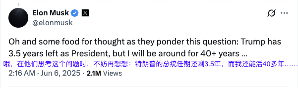
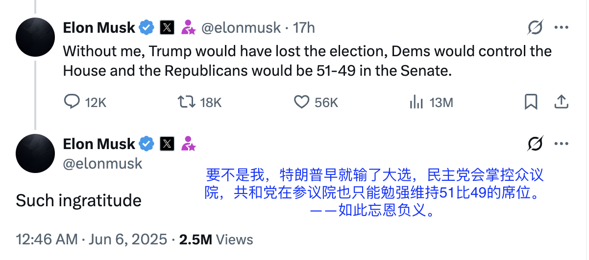
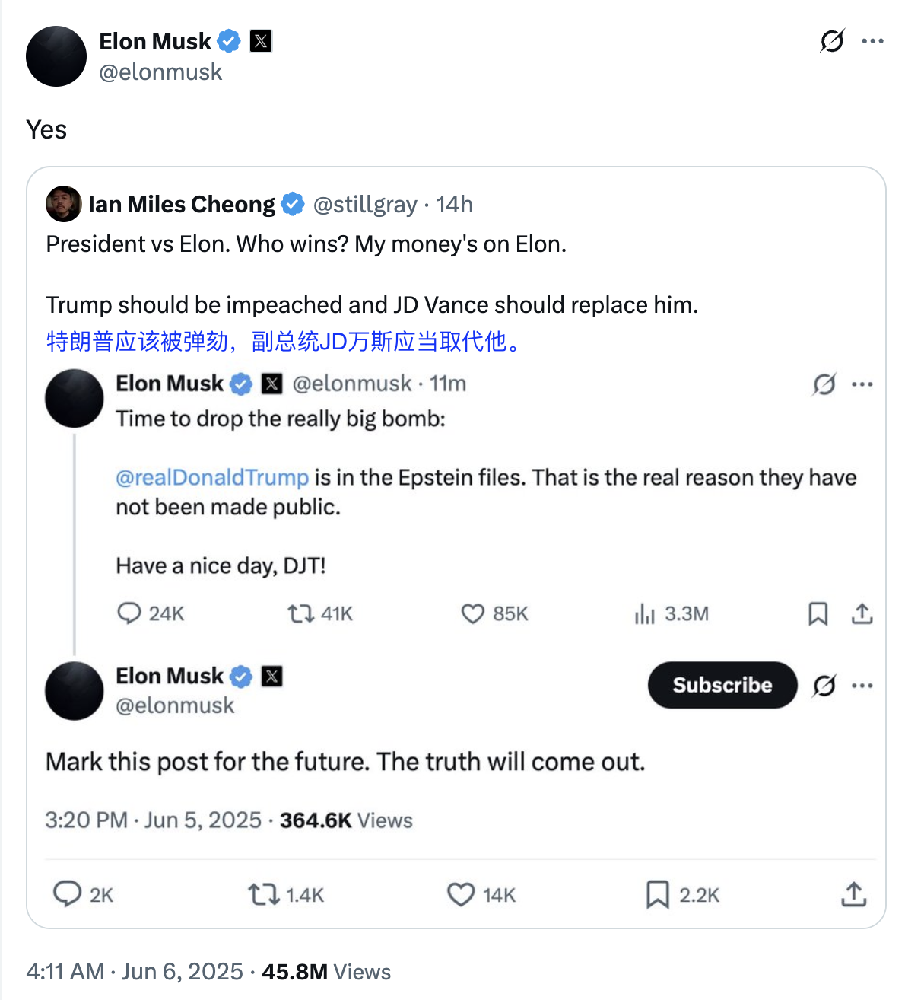

# 铁打的夫人，流水的县长

6.6教链内参《特马裂》，加密市场大跌。BTC一度接近回踩100k关键整数位。

马斯克推文：「特朗普的总统任期还剩3.5年，而我还能活40多年……」

当教链看到马斯克发帖如是说，便刚巧想起《让子弹飞》开场一幕中，县长夫人（刘嘉玲饰）坐在马背上神态轻松地自我介绍说，「我就是县长夫人啊」，那意思就是后面和张麻子（姜文饰）滚床单的时候她又解释过一遍的，「谁是县长，我无所谓」。

毕竟，铁打的夫人，流水的县长，县长夫人心里面是明镜儿似的。

在进城的路上，夫人也说道，「我已经第四次当寡妇了」。

说白了，坐在自由民主的火车上，吃着火锅唱着歌，买官上任的捞钱团伙，县长夫人组建过四次。

马斯克推文：「要不是我，特朗普早就输了大选，民主党会掌控众议院，共和党在参议院也只能勉强维持51比49的席位。 ——如此忘恩负义。」

马邦德（葛优饰）的县长，是县长夫人出钱买来的。在县长、师爷、县长夫人这个捞钱团伙的“铁三角”里，县长夫人是投资人，县长不过是CEO而已。

县长死了，夫人就可以把师爷扶正成县长。马邦德以前是夫人的师爷，现在是夫人的县长。师爷死了，夫人上了张麻子的床，马邦德这个县长也就只能摇身一变又成了师爷——汤师爷。

在资本主义的自由民主权力规则中，夫人就是资本，县长就是总统，师爷就是备胎。备胎上台就成了总统。总统下台就成了备胎。风水轮流转，每隔几年就搞个大选转一转。轮流转的是县长和师爷，不变的是夫人。

吃火锅的时候，马邦德刚得意洋洋地念了一句「大风起兮云飞扬」，自比刘邦。刘邦自然是压过吕后，说这话岂不是露了本性，刚上位就想骑到夫人头上去吗？于是夫人直斥「屁！」见失言惹怒夫人，马邦德立刻收敛了得意，往回找补道，「刘邦就是个小人！」寥寥几个镜头，就深刻刻画出了县长夫人（资本）在团伙中拥有最高的实际地位。

夫人和师爷打情骂俏。她和师爷保持有一腿的暧昧，是为了制衡县长，以备县长不听话时取而代之。这就是三角形相互制衡，形成稳定的权力结构。没有布局师爷的夫人，地位是危险的。一旦把县长扶上位，难保他不会翻脸不认人，让夫人的投资打了水漂。

马斯克回复某网友帖子「特朗普应该被弹劾，副总统JD万斯应当取代他」说「是的」。

夫人是还在创业路上的新钱资本，每一次对人的投资都无异于一场豪赌。一旦赌输了，赔上的恐怕不只是金钱，还有自己的性命。

在去凶险异常的鹅城上任（创业）路上，夫人踹了马邦德，投靠了枪更硬的张麻子。重新做回师爷的汤师爷反了水，勾结了鹅城的老钱资本黄老爷，谋杀了夫人。

资本斗争的核心逻辑，正是通过大资本消灭小资本，实现资本的不断兼并。

而一心捞钱、背信弃义反了水的汤师爷，也没有落得一个好下场，屁股自挂了东南枝。

当然，现实世界时间线还没有演到谋杀夫人的桥段。

不过，就算是夫人死了，还有花姐继承衣钵。在张麻子革了黄老爷的命之后，和老三里应外合，挖了张麻子的整个核心团队，一起去了浦东。

在这个新的团队里，花姐就是新的夫人。

没有人愿意跟着张麻子这个前大哥重新上山继续革命。他们组成了新的团队，坐上了出发去浦东的火车。

去浦东的火车，和影片开头去鹅城的火车，恍惚间竟如此相似。

“骑马不姓马”的张麻子，怅然若失地看着远去的火车背影，泪流满面……

「危楼还望，
叹此意，
今古几人曾会。
鬼设神施，
浑认作，
天限南疆北界。
一水横陈，
连岗三面，
做出争雄势。
六朝何事，
只成门户私计。」
