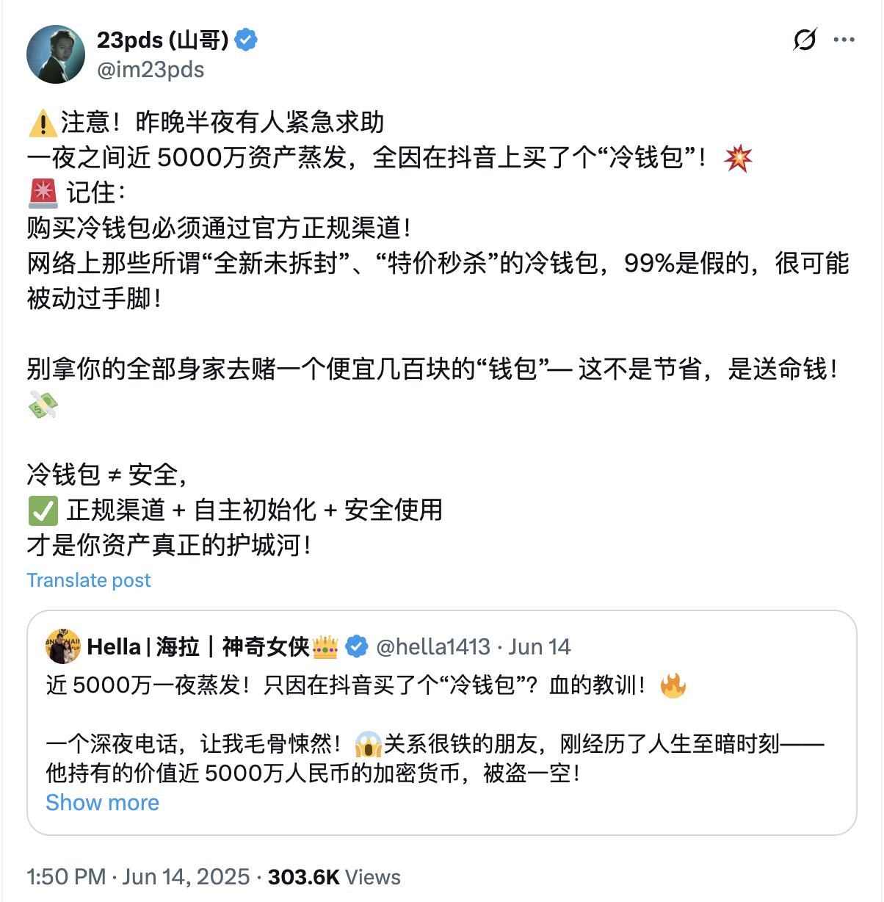

# 买个冷钱包，丢了五千万

BTC 105k。今6.15教链内参《第23周 大饼向上脱离失败 地缘动荡市场惊慌》通知：年中教链私董会初步拟定于2025年6月22日周日召开，本次会议形式为线下+线上旁听。目前报名系统已开启，请各位有兴趣参会的会员朋友登记报名（见内参中的海报）。

网上爆出一个悲伤的故事：某人通过短视频平台购买了一个所谓冷钱包（教链推测是指硬件钱包），存了价值5000万rmb的加密资产，被洗劫一空！

确认此事的是安全公司的人，所以说大概率是真事。

有很多朋友怀疑说，都是有5000万的人了，怎么会这么没有安全意识，或者，怎么会贪图那点儿小便宜去短视频平台或者直播带货平台上面去买第三方转售的产品？

教链倒是觉得：第一，大款被低级骗术骗走巨额财产的例子屡见不鲜，特别是暴发户，更是认知还没有跟上财富增长的速度，导致暴富后守不住财；第二，5000万是BTC涨了几轮到现在的价格了，如果是早些年买的，比如2013年那轮周期，可能也就是50万rmb而已。

财富水平已经暴涨到5000万了，认知水平却依然停留在50万的层次，可不就要眼睁睁看着财富从手中溜走嘛！

教链2025.5.18文章《白手起家三道坎》的第三道坎，说的就是守财的问题。

任何会接触、保存你的私钥或助记词的钱包或任何软硬件产品，都是极其危险的。绝不可马虎大意，随意地把资产控制权交出去，交给他们。

很不幸，硬件钱包正是这类最危险的产品之一。

硬件钱包必须直接从官方购买，绝对不能从第三方渠道转购，这是教链在《刘教链超级小白课》上千叮咛万嘱咐过的。——因为你永远不能确定，中间商是不是对硬件钱包动了什么手脚。

教链也不把硬件钱包视作冷钱包。因为在教链看来，它根本就不够“冷”：

第一，硬件钱包需要通电工作。它是热的，不是冷的。像不用依靠电能的纸质笔记本才称得上足够“冷”。

第二，硬件钱包也不是完全彻底离线的。它要么是通过一根USB数据线和电脑连接、传输数据，要么是通过无线协议比如蓝牙和电脑或手机等在线设备连接并传输数据。

带电运行加上数据链路，这就让硬件钱包的隔离根本做不到像真正的纸质冷钱包那样冷，那样断网，而是给黑客以可乘之机，只需在硬件钱包上动动手脚，就可以把你生成或倒入的助记词经由数据链路和互联网传播出去，发送给黑客。

教链2024.6.12文章《哪里能买到冷钱包？答案你肯定想不到！》写过，教链认为最佳的囤大饼冷钱包应该是离线生成私钥，直接抄写到纸质的笔记本上，锁在保险柜里。全程不触网。保存介质不带电，不能运行任何代码，也不能主动或被动传输任何数据。

很多冷钱包被盗事件，仔细一看，都不是足够冷的真·冷钱包。比如教链2025.3.16文章《冷钱包为何被盗》里介绍过的一个案件，其实受害者所用的所谓冷钱包，竟是web3多签钱包。这产品不仅联网，而且必须联网使用。这还谈什么冷钱包？！岂不是自欺欺人嘛！

还有人因噎废食，说从此把币放在中心化平台，这样万一丢了还可以指望中心化平台赔付。这是为了一点点恐惧，把身家性命全副交了出去，交到了中心化平台的手里。兜兜转转，中本聪要把财产主权还给个人，而个人却因为害怕这份责任选择了放弃财产主权，把这份权力拱手让人。君却忘记了Mt.Gox当年被盗的大户，熬到今天终于获得赔付，已是折价严重，不可能按照原始币量陪你；更别提一些卷款跑路的平台了。

安全问题无小事，绝不能掉以轻心。但是也不能因噎废食，因为内心恐惧，或者不愿承担自己的责任，抑或不想学习，而选择退而求其次，把大额资产拱手托付给中心化第三方。
