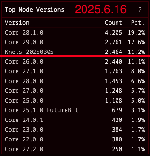

# Knots杀入前三

BTC 106k。今6.16教链内参《周期的十字路口》提到，Bitcoin Core客户端的替代品——Bitcoin Knots客户端的市场采用率今天杀入前三名！

上图是Clark Moddy根据bitnodes.io的数据所作的统计。目前节点采用率排名第一的是Bitcoin Core 28.1，占比19.2%。第二名是Bitcoin Core 29，占比12.6%。第三名就是Bitcoin Knots，占比11.2%。

如果你对这个数字没有什么感觉。那么不妨回看一下，仅仅在短短一个多月以前的2025.5.8教链文章《OP_RETURN：最严重的BTC争议之一》中的截图，当时Knots的采用率还仅有4.54%。

一个多月，采用率暴涨一倍还多！

原因很简单，教链在上面5.8文章以及2025.6.8文章《比特币核心开发与交易转发策略》介绍过了。要说还得拜Bitcoin Core维护团队的“骚操作”所赐，在向Bitcoin账本（即区块链）中塞入非BTC交易相关的其他数据这个问题上，他们抛弃了2015-2017年与矿工集团坚持斗争的精神，选择了向矿工利益妥协，决定做一把矿工集团的“帮凶”，在代码中逐步废弃既有的附加数据过滤开关。

请注意：在默认发布中废弃过滤开关，并不是一个价值中立的行动，而是有着鲜明的政治立场的。

考虑为挖矿利益驱动、资金实力雄厚的矿工，和自掏腰包运行全节点、势单力薄的个体之间，力量对比和博弈并非均势。

相比而言，矿工，尤其是大矿工和矿池，可以轻而易举掌握相关技术，对Bitcoin客户端代码进行任意修改。即便Bitcoin Core的默认发布中保留过滤，矿工也可以通过自行定制代码移除相关限制。

而对于一个个分散的个体全节点，形单影只，财力和技术都很薄弱，大部分个人只有能力下载默认发布的客户端软件运行，无力进行修改和定制。

也就是说，Bitcoin Core更应该站在个体全节点一边，按照他们最希望运行的特性来设置控制开关和默认参数。

若Bitcoin Core站在大多数用户一边，这样就与掌握算力强权的矿工集团形成抗衡和博弈均势。矿工仍然可以有力量自行修改代码，并通过自己掌握的算力强权去推行，但会受到大多数用户的反制和约束。

而若Bitcoin Core站在矿工一边，那么就是代码修改权（立法权）和算力强权（执法权）同流合污，对大多数的用户和分散个体实行强制和压迫。

也就是说，从Bitcoin整个生态的力量均势角度来看，Bitcoin Core选择中立就已经是不中立了。他们必须坚定地站在矿工的相对面，代表更大范围的节点用户、钱包用户的利益。

如果把算力比喻为枪杆子，那么应该是代码指挥枪杆子，而不能反过来，让枪杆子指挥代码（的修改）。

那么，如何才能让掌握暴力的矿工集团听命于代码的指挥呢？答案早就有了，那就是坚定的站在最广大的用户一边，代表最广泛的用户利益。

现在，Bitcoin Core团队一意孤行地要背弃政治初心，选择以中立的姿态向暴力集团妥协。教链在2025.6.10文章《警惕！Bitcoin Core已合并PR#32406》中已经警告，Bitcoin Core团队不顾分歧和反对，强行推进该项政治议程。宣称废弃过滤开关的新代码据信将会在今年十月份左右的Bitcoin Core 30中发布。

在博弈中，没有对错之说。一切只取决于你所站的立场。你站这边，就会说这边是对的，对边是错的。你站对边，就会说对边是对的，这边是错的。

站在博弈局中，争吵谁对谁错毫无意义。

跳到局外，从更高的维度来看，是非、利害又是极其分明的。很显然，博弈制衡加强，有利于Bitcoin这样一个以去中心化为生命的共同想象；博弈制衡削弱，有害于Bitcoin。

幸运的是，中本聪充分考虑了Bitcoin每一个层面的去中心化和消除垄断的最佳选择。在代码这个层面，他选择了开源全部Bitcoin的代码。Bitcoin Core虽然继承了中本聪的代码，却不能真正地垄断它。

只要有志之士——比如开发者Luke Dashjr（关于他，可延伸阅读2024.3.22教链文章《Luke Dashjr: 比特币传奇》）——愿意，就可以fork Core的开源代码，并添加社区呼吁的能力，然后进行发布。

是的，Bitcoin Knots客户端就是Luke Dashjr基于Bitcoin Core客户端，添加或增强了所谓垃圾数据过滤功能的瘦身版客户端。

任何不想浪费自己宝贵的存储资源的用户，都可以选择运行Knots客户端。

背弃政治初心的Bitcoin Core，就会被用脚投票的人民抛弃。

Knots客户端的采用率激增，恰恰是对代码修改权力的有效监督、约束和制衡机制可以运转的无声证明。
