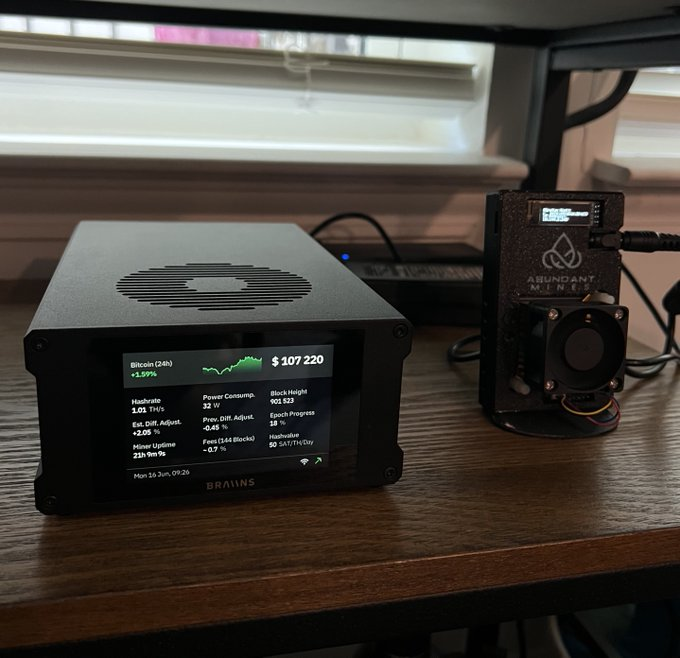
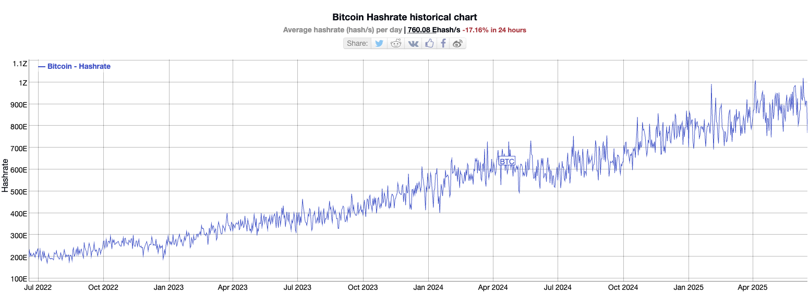

# Solo挖矿中奖概率比彩票高吗？

BTC 105k。

Solo挖矿，故名思义，就是个人矿工。虽然目前BTC挖矿大部分算力都是集中在矿池，由几个大矿池来根据所谓算力贡献度分配奖励，但是，仍然有不少人，选择用自己的算力进行单挖。

相比于稳定地从矿池领取“工分”，自己单挖则无异于一场“要么爆块、要么白费”的豪赌。对于今天的BTC区块奖励而言，爆一个块意味着单挖者独享3.125个BTC，约合30多万美刀。但是，爆块的概率却实在是低到希望渺茫。

Solo爆块的概率有多低呢？

根据BTC全网算力估计图，目前全网算力大概在900E（900EH/s）上下。为了计算简便，取900E。这个数字，意味着BTC全网每秒钟大约能够计算900E个哈希。惊人的天文数字。

据网友Matt Cutler的估算，如果用一台算力为1T（1TH/s）的桌面矿机，那么根据独立同分布假设，爆块概率就是1T/900E = 1/900M，即9亿分之一。

这个概率有多低？按照BTC全网平均每10分钟爆一个块来看，那么平均需要90亿分钟，也就是1.7万年，才能撞到一次爆块。

作为对比，他列举了一下两个典型的彩票产品的中奖概率：

- Powerball Jackpot（强力球）：1/292M，即2.92亿分之一。
- Mega Millions（超级百万）：1/303M，即3.03亿分之一。

很显然，从表面的数字看起来，爆块概率要远低于这两款彩票的中奖概率。

且慢。我们忽略了时间。两款对照彩票的开奖时间分别是一周3次、一周2次，远远低于BTC的每10分钟开奖一次。

中奖概率都按3亿分之一计算的话，一周3次，那么平均需要1亿周，即192万年，才能中到一次大奖。

很显然，看起来Solo单挖还是要比买彩票中奖概率大。

让我们把时间考虑进来并对齐：

每周：

- 强力球（开奖3次），中奖概率：1/97M，9700万分之一。
- 超级百万（开奖2次），中奖概率：1/151M，1.5亿分之一。
- Solo单挖（1T算力）（开奖1008次），中奖概率：1/892K，89万分之一。

每月：

- 强力球（开奖12次），中奖概率：1/22M，2200万分之一。
- 超级百万（开奖2次），中奖概率：1/35M，3500万分之一。
- Solo单挖（1T算力）（开奖4320次），中奖概率：1/208K，20万分之一。

每年：

- 强力球（开奖156次），中奖概率：1/1.87M，187万分之一。
- 超级百万（开奖104次），中奖概率：1/2.9M，290万分之一。
- Solo单挖（1T算力）（开奖5.2万多次），中奖概率：1/17K，1.7万分之一。

挖矿爆块概率比彩票中奖概率高100多倍。

当然，概率计算告诉我们，哪怕是概率高100多倍，对于绝大多数人而言，仍然是贡献大于收益，付出大于回报，简而言之就是——挖矿亏钱。

因为大部分人的寿命只有不到100年，是1.7万的近两百分之一。

这恰恰是BTC底层设计的巧妙之处。

试问这世界上有哪种投资品（投机品），参与的人数特别巨大，大部分人投钱的人都亏钱，但是所有人都乐在其中不能自拔呢？

可能有喜欢调侃的朋友会回答**。错。

正确答案是：彩票。

BTC的PoW挖矿，激励机制很像彩票。

矿工虽然不挣钱，但是他们孜孜不倦的计算，却为这世界上最大的“公益事业”——维护BTC公共账本，自愿自动自发地作出了卓越的贡献。

恍惚间竟有一种公益彩票的精神在其中。

BTC诞生16年，年年都有人质疑，当未来随着奖励减半越来越少，挖矿不挣钱了，BTC网络将以何维持？

这就是犯了静态眼光看问题而不是发展眼光看问题的教条主义错误。

只是因为目前阶段BTC大多以矿池和矿企提供算力为主，所以人们才会质疑说这些企业要利润、要赚钱，否则就不会继续挖矿、继续提供算力了。

也许这正中设计的下怀呢！

当为了赚钱才来挖矿的矿工矿企都因为利润减少逐步退场，不为赚钱、不怕亏钱而是亏钱买乐子的Solo矿工、家庭矿工将逐渐接替他们的历史地位。

到了那个阶段，BTC也已经进入相对成熟的阶段了。

目前的现状，不过是BTC仍在高速成长（体现为价格迅速升高）的阶段性表现罢了。

从金融的角度看，BTC是不生息的非剥削性货币。在BTC链上不允许传统金融体系中的部分准备金制度和信贷扩张。因此，根据上世纪就已经研究明白的金融理论，一家提供这种货币存款而不许放贷的金融机构，不仅不能向储户支付利息，反而还要向他们收取管理费，否则就从经济上不可持续。

BTC网络，就好比是这样一家提供BTC存款而且不能放贷的机构。一家分布式的，由分布在全球的十数万、数十万矿工共同运维的一家虚拟机构。

因此，个体矿工所付出的电费等成本，其实就是经济学家所说的支付给这家存款机构的管理费。

不同于今天矿工的挖矿动机来源于赚取区块奖励（本质上是稀释全体持有者的价值）和转账手续费（交易者愿意支付的费用），未来的个体矿工，就是自己囤BTC、把BTC当作储蓄的个人用户，或者企业用户，他们愿意支付运行这样一个挖矿节点的成本的动机，是为了确保自己存款的安全。

今天全网几家大矿池总共汇聚的算力大约是900E。假设化整为零，分散到900万用户头上，那么每个用户将平均需要提供100T算力。

未来随着算力效率的提高，能耗进一步下降，静音技术进一步改良，电费进一步下降（如热核聚变发电），甚至可以副产物再利用（比如芯片散热取暖），每个用户提供100T或更高算力也不是不可能的事。

我们从现在就应该为未来考虑，确保BTC账本尺寸的精简，严控垃圾数据和滥用，以避免未来积重难返，无法重新走向更大程度的去中心化。
