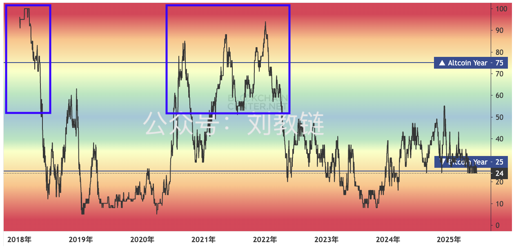
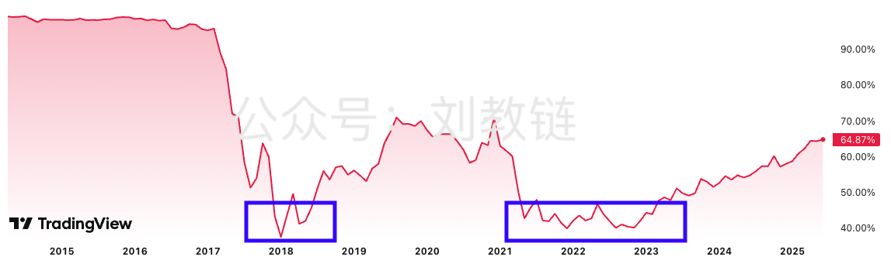

# 结构性牛市

BTC 104k。

在筹备后天的年中教链私董会的过程中，教链把过去5年的年终报告都一股脑儿的翻出来，又翻来覆去的看了几遍。

这些当时时点写下来的文字记录，具体而真实。有猜对的，也有猜错的。对错其实并不是那么重要。重要的是，文字可以把思绪拉回到N年前的那份心绪，消除了回忆的滤镜。站在彼时彼刻的时间节点，面对前方的迷雾，当时自己的所思所感。当此时此刻再回首，一些迷雾已经明朗，两相对照，几多唏嘘。

5年前的2020年年终，教链写道，“本轮牛市很可能是一个结构性牛市”。什么意思呢？意思就是说，“不会出现全面普涨，而是有的板块能够跟上比特币甚至跑赢比特币，有的板块则不会有行情。”

不过，2021年所谓的机构牛年，其实事后看来，依然是币圈几个大庄猛加杠杆堆出来的。那一轮牛市，结构性分化其实还不是很显著。我们依然见到了非常典型的山寨季节——山寨币指数飙升，而BTC市值占比大幅下降。

一言以蔽之：群魔乱舞。

由于统计范围和统计方法的不同，对于山寨季的看法也会有所差异。但是，从人们普遍的模糊记忆上来说，2017年底到2018年初（牛尾）和2019年初（IEO），还有2021年底到2022年初（牛尾）和2023年初（铭文+meme）这几段时间，都会感觉到明显的“野蜂飞舞”的景象。

牛尾的山寨季，符合扩散效应的原理。复苏周期的起点的跃跃欲试，则是从深熊中活下来的大庄又蠢蠢欲动地开始搞事情。

不过，如果一轮轮周期下来，大庄总是那几个平台在那里翻雨覆雨，搞得各种花样翻来覆去也都是新瓶装旧酒，不管名头叫啥，掀开遮羞的盖头来，无非就是「发钱刺激刷量-刷量刺激发币-发币吸引韭菜-韭菜提供利润-利润拿来发钱」这么个循环游戏。

从2017的ICO，到2019的IEO，再到2022的NFT，到2023的铭文，2024的meme，贯穿始终的，是平台背后各种所谓“创新”的暗流涌动。这些所谓“创新”，无非是让品质更差的币（标的）以门槛更低的标准大量涌向市场，再让韭菜充进平台的钱，更加丝滑无障碍地投入到这个循环游戏中去。

可是这个行业，难道可以一直依赖于这种金融空转的方式向前发展吗？教链在6.19内参《催熟土狗玩法日薄西山》中对此进行了反思和质疑。

显然不可能。

当行业演进到meme制造机一日千币万币地发行时，这个市场就已经陷入供给过饱和状态了。

一边是山寨币供给过饱和，另一边是BTC市占率节节攀升，可想而知，能够一飞冲天制造出暴富传说的山寨币肯定是越来越少了。

当市场中不是闭眼买都能赚的时候，就出现了结构性分化。

从2023到2025，BTC市占率一路从40%升至如今逼近65%，而过去两年多各种铭文、meme、土狗、空气等各类山寨币总数量几乎已经堆积到了一个天文数字，这就是为什么这轮牛市到现在，押对宝的人可能已经赚得盆满钵满，押错宝的人却仍深陷套牢泥潭，望眼欲穿地等待所谓的“山寨季”。

结构性分化的市场，必然造成结构性分化的盈亏。

加密市场即便是牛市，也不再是人人都赚钱了。换句话说，市场变得更难玩了。

这就应了教链几年前说过的，机构牛机构牛，第一机构不是吃素的，第二机构不是来做慈善的，机构下场，散户的好日子就要到头了。

这轮周期，我们才开始初窥华尔街金融正规军的本事。

他们怎么可能来陪散户韭菜玩什么meme、土狗？开什么国际玩笑呢！

华尔街第一板斧干的是现货ETF。直接分流了BTC场内现货交易量。现在一年多过去，BTC ETF的交易量据称已经占到10%的BTC现货总交易量。也许不久的将来，也许只需要几年时间，ETF分走一半甚至更多BTC交易量都不是不可能的事。那些钱都在美股市场，不会来陪币圈韭菜玩土狗。

华尔街第二板斧干的是合规稳定币。这就是明牌挤压不合规的老牌稳定币USDT的市场，对整个币圈来一个釜底抽薪。合规稳定币未来干得是合规生意，比如接入各行业（比如电商、打车等）线上支付，赚的是合理合法的利润，比如背书资产（比如短期美债）的利息。玩合规稳定币的钱，也不太会是来给币圈韭菜接盘土狗的。

华尔街第三板斧干的就是收割韭菜。美股市场早年也是散户居多，你猜猜为啥发展到今天散户基本上都被赶尽杀绝，乖乖把钱交给机构打理了呢？当华尔街机构可以和总统合作，连续发布消息，反转反转再反转，一波三折，拉盘砸盘的时候，你一个小小散户又当如何自处呢？

三板斧干完，牛市就到了今天这个样子。

接下来的市场，不会让散户更舒服。

生存竞争是残酷的。不要幻想可以躺在温柔乡里轻松地赢。

与狼共舞，唯有勇有谋者才有资格生存。
