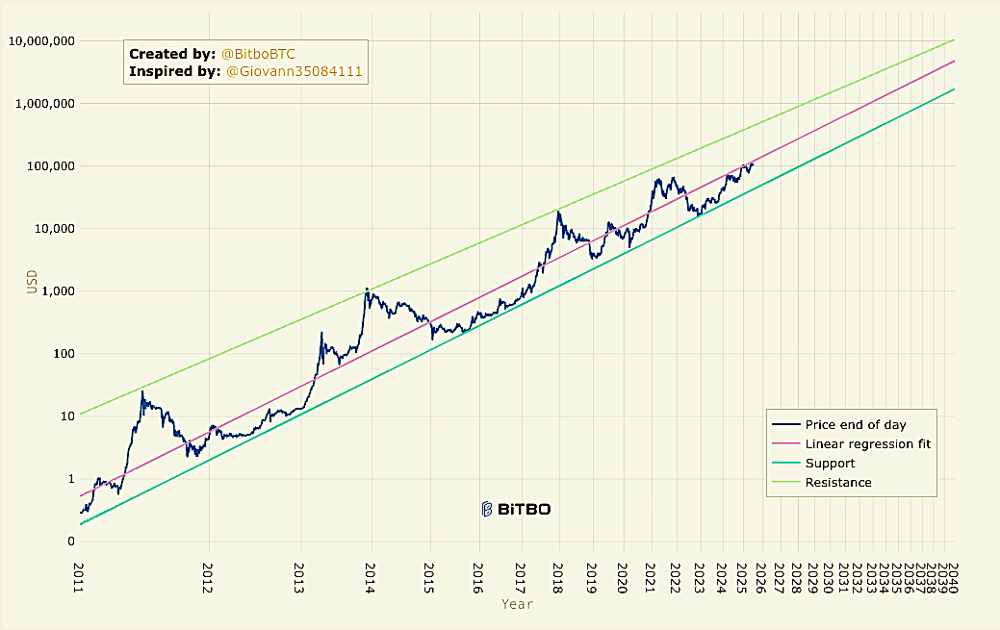
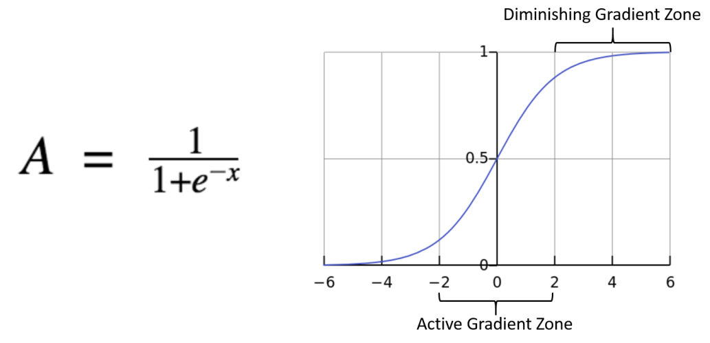
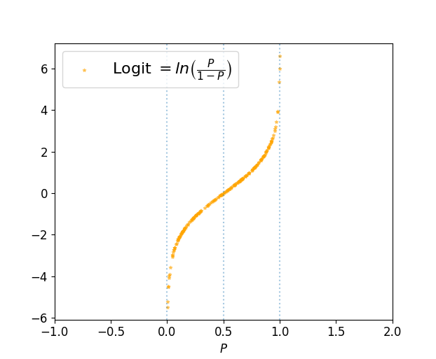
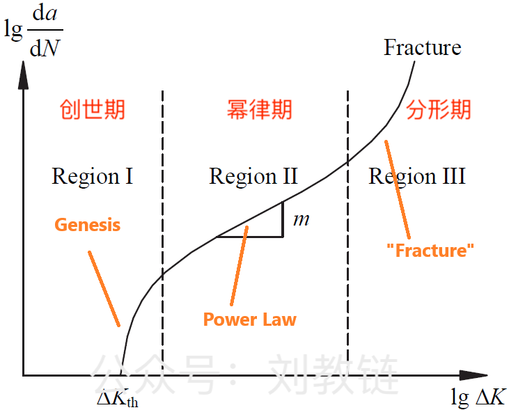
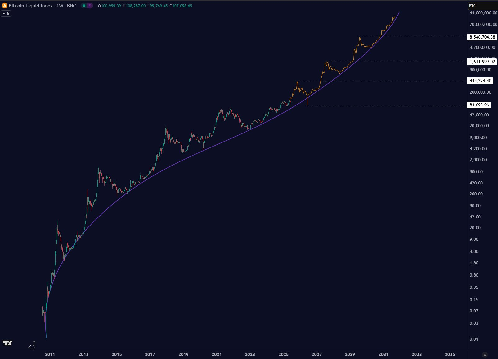

# logit曲线和BTC分形

BTC 108k。

最近两轮周期，BTC的增长率是肉眼可见地在衰退。即便是放在双对数坐标系上的幂律模型，目前也开始偏离既定的成长轨道。

看起来，要么我们接受一个早衰的BTC，要么我们期待它回归幂律，或者，我们可以期待前方迎来大突破。关于大突破，教链在2024.10.17文章《大突破：BTC反幂律增长的另一种猜想》中曾作过简要介绍。

在AI所用的深度神经网络中，有一类被用作激活函数的函数称为Sigmoid函数。

$$S(x)=\sigma(x)=\frac{1}{1+e^{-x}}$$

它的图像是这样的：

因其形似字母S，所以又被称为S-曲线。

而Sigmoid函数的反函数就是logit函数。

$$logit(p)=\sigma^{-1}(p)=ln\frac{p}{1-p}$$

它的图像：

有人猜想，我们是不是正处于BTC第一个幂律期结束的阶段，即将转入分形期？

创世期、幂律期、分形期。分形期也许是下一个更大周期的创世期？

对于宇宙的浩瀚，我们无法想象。对于BTC的未来，我们有限的想象力似乎也无法触及。

如果说1971年布雷顿森林体系解体，美元脱钩黄金，开始无锚印钞，直至2008年金融危机，美联储开动QE，美元正式进化成为美债的代币，这是BTC过去十六年幂律期增长的宏观因，那么当2025年美元稳定币法案被立法确认，美债即将找到摆脱包括国会批准债务上限以及美联储决定债务货币化规模的形式化约束的出口，美元摇身一变，变成美元稳定币这一次级信用形式的时候，人类命运的齿轮已经悄然转动，历史的车轮将不以任何人意志为转移地轰隆隆向前滚动，无情碾过每一个反对者和无视者的脆弱身躯，BTC转入分形期再加速似乎也就已然在酝酿之中了。

开始，渐渐地，然后，突然地。

后知后觉者只会在事后拍断大腿。先信先行者总是时刻做好准备，迎接一个巨变的时代。

有人总会抱怨说，难道仅仅因为你比我先看懂先拿住了BTC，你乃至你的子孙的财富水平就要比我乃至我的子孙的财富水平高出十倍百倍，这公平吗？

这自古以来都相当公平。

识时务者为俊杰。何况是在人类五千年文明史上首个从原子货币向比特货币转变的货币大革命进程中，正确识别并牢牢把握风向，做出历史性的正确选择并坚持到最终完全胜利的人呢？必可谓是人中龙凤。享一世荣华乃至于泽被子孙，也是命运予以其应得的奖赏而已。

也许唯一限制我们的，只有我们贫乏的勇气和想象力了吧。

正如网友所说的，想象一下，如果所有人都低估了后市的牛，会怎么样？

[gimmick:math]()
