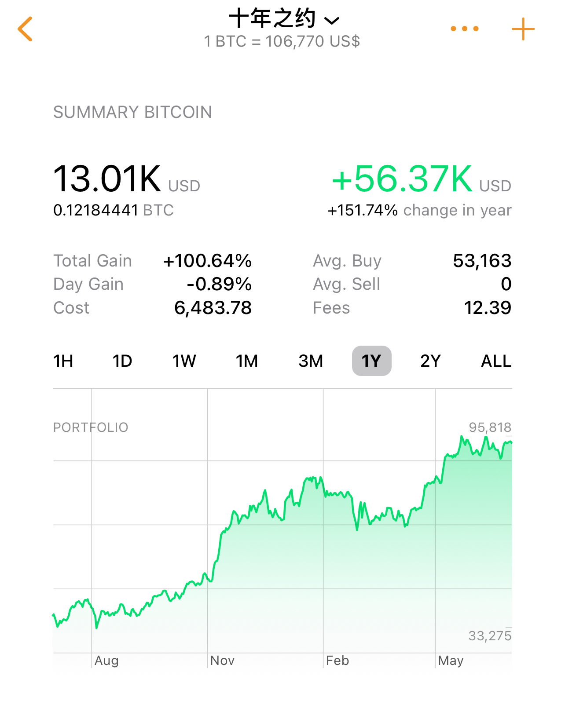

# 十年之约系列(49)：人生的避险资产

BTC 107k. 高位盘整。

“十年之约”计划，第49篇笔记，6月收涨不加。目前计划执行已满2年，收益率刚好在100%左右。折合CAGR应该就在40%年化左右。

人们常常辩论，大饼究竟是风险资产，还是避险资产。看它短期的波动性，以及与宏观事件的关联，倒像是个风险资产，而非避险资产。

但是如果我们把变量代入人生的视角，则又会得出完全不同的结论。

回归初心，直达本质，扪心自问，我们为什么要持有大饼？更一般的，我们为什么要投资，为什么要持有资产？

价值存储。什么是价值存储？储蓄。为什么要储蓄？以备不时之需。备不时之需，就是对冲人生前路不可预知的风险。这就是避险。人生的避险。

俗话说，明天和死亡，不知道哪一个先来。

对打工人而言，明天和失业，不知道哪一个先来。

对小老板而言，明天和破产，不知道哪一个先来。

人生不满百，常怀千岁忧。人不能杞人忧天，但也绝不能不未雨绸缪，为未来可能的风险提前做好充分的避险准备。

打工的任务，就是从上岗第一天便开始为失业做准备。实现财务自由，就是成功对冲失业风险的答卷。

经营的任务，就是从开业第一天便开始为破产做准备。建立大饼储备，就是加入了一张财务互助的网络，实现风险全球化分散。

自己的主业与大饼的波动性相关度越低，储备大饼对冲风险的效果就越好。

教链还记得曾经有一个经典案例。某健身房老板，在2020年前开了几家挺大的健身房，忽然疫情就来了，生意立马熄火，幸而这位老板此前有储备若干大饼，赶上2021年大饼牛市，帮他成功度过了生意上的生死危机。

至于打工人因为早年囤大饼而早早实现财务自由，在这个经济萧条周期度过失业危机、中年危机的例子，则更是数不胜数。

当然，也许我们迄今仍然还在康波萧条周期的底部。这样的萧条期，最能教育人。教育人们，学会为人生中的风险对冲和风险规避做好规划和准备。

自然选择法则之一就是优胜劣汰。善于学习、善于变通的人，总能够抓住冬天的机会，熬到下一个春暖花开的季节。
