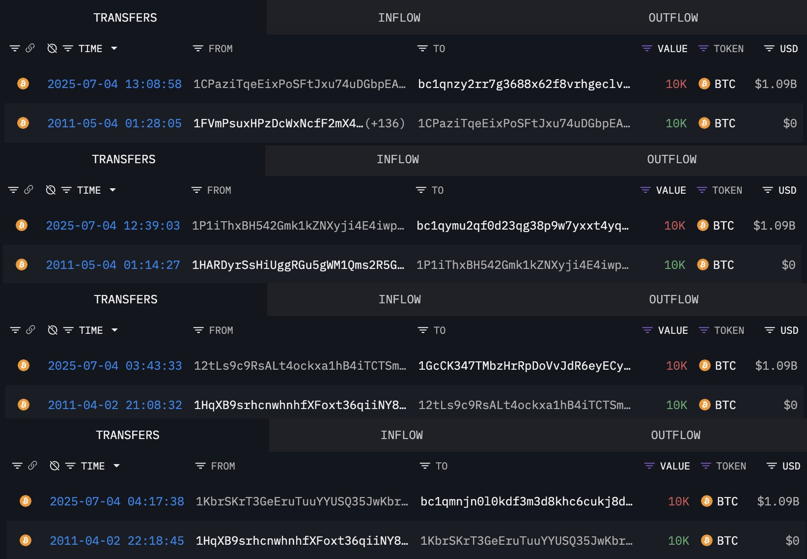

# 巨鲸苏醒

BTC暂时未能守住110k，回撤至108k。

据链上监测显示，一个2011年的远古巨鲸忽然苏醒，移动了数万枚BTC！

据信该远古巨鲸总共控制着8个钱包地址中的总计8万枚BTC。

其中2个钱包地址中的2万枚是在2011年4月2日入账的。当时BTC价格仅有0.78美刀。也就是说，当年这2万枚BTC价值仅有15600美刀，今天则已高达约21亿美刀。增长了13多万倍！

另外6个钱包地址中的6万多枚是在2011年5月4日入账的。当时BTC价格约为3.37美刀。当年的6万多枚BTC，价值约20万美刀，今天则已高达约65亿美刀。增长了3万多倍。

这八个钱包地址是：

1KbrSKrT3GeEruTuuYYUSQ35JwKbrAWJYm
12tLs9c9RsALt4ockxa1hB4iTCTSmxj2me
1P1iThxBH542Gmk1kZNXyji4E4iwpvSbrt
1CPaziTqeEixPoSFtJxu74uDGbpEAotZom
1f1miYFQWTzdLiCBxtHHnNiW7WAWPUccr
1BAFWQhH9pNkz3mZDQ1tWrtKkSHVCkc3fV
14YK4mzJGo5NKkNnmVJeuEAQftLt795Gec
1ucXXZQSEf4zny2HRwAQKtVpkLPTUKRtt

如今，这位拿了14年没动的巨鲸，竟然开始在整理钱包地址，清空旧地址，转入新地址。

意欲何为？

有网友说，这真是个传奇，证明了时间和BTC的力量。

教链却隐约有不详的预感。因为今天7.4内参《高价低波动率背后暗流涌动》刚好说到远古巨鲸苏醒抛售的风险。

内参里写的控盘、做价、换庄、供需失衡等等，不再赘述。但是10x research研究的历史数据的确令人两股战战。

对历史数据的研究表明，2018 年和 2022 年，仅 2% 和 9% 的资金流出就分别引发了BTC价格下跌 74% 和 64%。

而现在市场里的流动性，因为大而美法案的通过，以及美联储咬住不松口，又将面临TGA抽水的考验。这个也是内参中提到的。

虽然下半年大家都盼着下半场再来一个轰轰烈烈的主升浪，可是眼目前的这道关，看起来可能会很有考验。

关关难过关关过。BTC这么些年，多少生死攸关都闯过来了。其实这些挑战都是小菜一碟。

只是对于懵懵懂懂的韭菜们，恐怕会在骇人听闻的滔天巨浪中不断翻船，被洗得兜比脸还干净吧？
