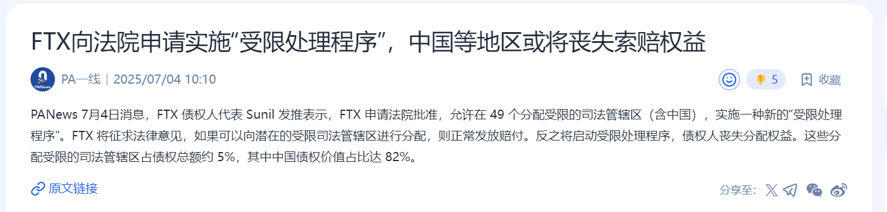

# 从FTX拒赔一事说起

最近有一个令华语加密圈颇感愤慨的事，就是2022年因为擅自挪用用户存款（托管在平台的加密资产）遭遇挤兑暴雷的知名交易所FTX，在执行清算赔付的过程中又出幺蛾子，准备找借口把含中国在内的49个国家或地区给排除掉。

这个事情无疑是十分恶劣的。这样的先例一开，以后各类海外的加密平台都可以通过破产清算来逃避对中方债权人的债务了。它们抓住了目前华语加密圈目前的软肋，即参与度高但全球维权能力弱。

有网友指出，也许唯一可能获得法律救济的途径是联合起来去美国起诉，运用美国的法律武器，以子之矛攻子之盾。

美国的好处是认钱。你只要有足够多的钱，就有机会把美国的法律武器为己所用。美国的坏处也是认钱。一分钱难倒英雄汉，对于大部分囊中羞涩的散户而言，拿起美国法律武器的门槛费实在是有点儿太高了。

加密行业存在很多悖论（paradox）。比如其中一个，不出事的时候都举着去中心化、不要监管的大旗，可是一出事了纷纷都去寻求监管和传统秩序、链下暴力机器帮忙主持公道。

如果你能够看透事物的表面，就很容易发现，加密行业的绝大部分项目和平台，都是存在中心化控制的。那么你如何确保控制人能够履行承诺的义务？只有三个选项：第一，寄希望于他的良心。第二，依赖更高层次的权力即政府监管部门的约束。第三，你自己有足够的实力拿捏住他。

第一个选项是傻白甜，但是很多很多散户都选择了这个天真的选项。第二个选项是对外部中心化权力的依赖，这就是向传统金融秩序回归。第三个选项是博弈论。

很多人会纳闷，都说金融资本是收割者，可是自己这个投资者为何总是成为别人收割的韭菜？其实区别就是对于暴力的掌握。这决定了你是资本还是韭菜。

现实世界中最硬的暴力就是枪杆子。权力的真实底色。

网络论坛上常有人辩经，争论资本和权力哪个更厉害。其实他们的争论从根上就是错的，因而使得后续一切辩论都变得无意义。

不掌握权力的资本不配称之为资本。它不过是披着资本外衣的大号韭菜。

因此，资本在谋求自身安全的成长道路上，便会走向谋求和夺取政治权力。

从这个角度看，就能非常清晰地理解马斯克从支持共和党上台，到现在自行成立第三党“美国党”的全部动机和心路历程。

这种对政治的投资，也是一种风险投资。

风险投资如果不具备把被投资者送进去的实力，那么所谓的风险投资就不过是韭菜而已。

发币融资的所谓把早期参与项目的机会开放给散户，让散户获得以前为专业风投机构所专享的投资机会，无异于一个很难被识破的美丽的谎言。为何？因为绝大多数散户根本不具备拿捏和搞定被投资者也就是项目方，迫使其履行承诺的能力。

一次又一次深刻的教训应该让我们明白，当我们决定要参与一个项目之前，先扪心自问一下，接下来这场充满风险的豪赌，会不会成为一场韭菜之旅。

由此便愈发认识到BTC的宝贵。

BTC赋予个体通过私钥密码学对BTC所有权的绝对控制，不需要寄希望于任何人的良心，不需要依赖传统暴力机器和政府监管对人们相互履约的约束，不需要要求个人有对他人实施暴力以约束对方的能力。

这样一种和平的、低成本的、不能被违约的产权，在BTC出现之前，人类从未享受过。

一旦你认识到这一点，就会深刻知道评价它如何弥足珍贵都不为过。
