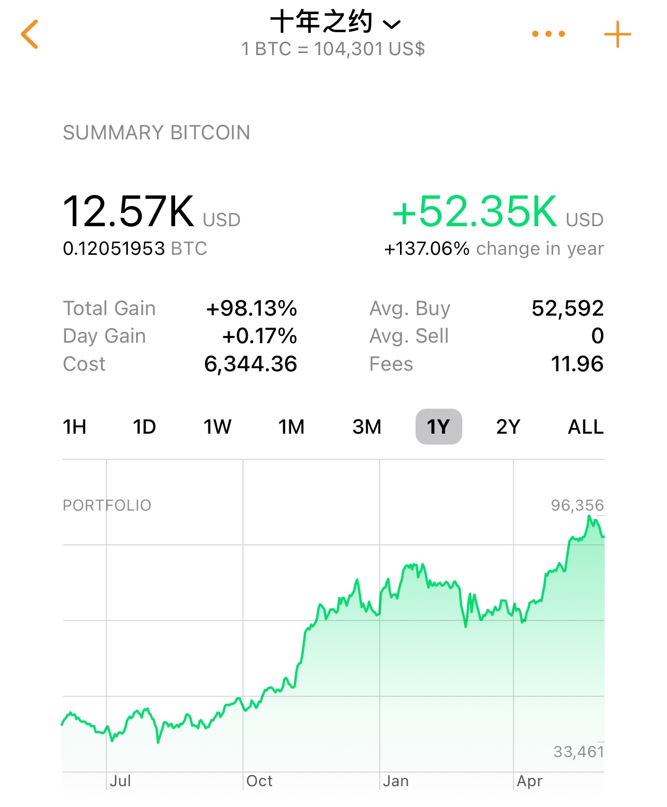

# 十年之约系列(47)：道可道非常道

端午节赶上儿童节。BTC经历了4月、5月连续两个月上涨，暂时维持在104k附近。5月开盘94k，最高112k，最低93k，收盘104.5k。收涨不加。本篇是“十年之约”实盘见证计划第47篇笔记。目前持仓成本5万多刀，ROI约在97～98%左右。

三天小长假本想周六就带娃出去玩两天，但是二娃和我分别提案的两处目的地都被大娃给否决了，于是第一天就没有能够决出结果。在吃喝玩乐的事情上，我家采取的是平等民主的一票否决制。两大两小就像联合国安理会4个常任理事国，谁都可以对别人的提案一票否决。这意味着能够执行的结果必定需要全票通过，即不存在多数强制少数服从，也不存在少数强制多数服从，这样可以让每个人都感受到尊重并对计划感到满意。当然，代价就是决策效率较低。不过，大人可以通过保留否决权但不行使的办法对娃的需求进行妥协，从而提高达成一致的可能性。

保留否决权但不行使，和不保留否决权，全权交由娃做决定，看似效果是等价的，但其实是有很大差别的。我们希望让娃有尽量多思考、分析、提案、做决策的锻炼机会，以及俩娃之间沟通、协商、妥协、做交易的练习机会，但是又必须有随时踩刹车的能力。

相对最难处理的往往是俩娃的想法和意见出现严重冲突的时候，譬如吃饭时，一个坚持要去吃A，另一个坚持要去吃B。这时候我通常就要作为斡旋方，帮助他们分析不同选项的利弊，努力达成一致意见。

在这种平等民主的表决机制的情况下，提高效率的办法是就一些典型场景形成惯例（convention）、共识（consensus）乃至于文化（culture），比如长跑后吃什么，把它固定成惯例，这样就可以避免每次都要重新进行决策。

今天去近郊爬了个小山，陪娃一起玩了很多有趣的挑战性项目，像什么攀岩、钻管子爬坡、爬网、吊桥、滑梯、蹦床等等。项目很丰富，娃玩的也很开心。天阴阴，山谷烟雨朦胧，空气湿润得像南岳。置身水烟雾气之中，仿佛人间仙境。一路上，聊东聊西，聊化学，聊英语，聊数学，聊诗歌——诗歌的魅力全在于想象呵：

正常说话：我想吃麦辣鸡腿堡配薯条可乐。

诗歌：

我把我的心 /
抛进了麦当劳的店里 /
我想吃麦辣鸡腿堡配薯条可乐。

聊作文——作文是把5句话的干货注水扩写成500字，就像许多食物，都是含颇多水分的，譬如西瓜，八九成都是水，水灵灵的才好吃。

太干的干货，读起来简直就是味同嚼蜡。

古人受制于技术限制，不得不把表达欲压缩压缩再压缩，以求尽量简洁，毕竟在龟甲、竹签上刻字可不像敲键盘打字那么容易。于是聊到《道德经》。

道可道，非常道。名可名，非常名。无名，天地之始。有名，万物之母。故常无，欲以观其妙。常有，予以观其徼。此两者同出而异名，同谓之玄。玄而又玄，众妙之门。

在背诵了一遍第一章之后，我说：这第一句“道可道非常道”自古以来就有很多种不同的理解和解读。

譬如一种理解是这样的：这句话里的“道”有两个意思。“道”是道理、规律、方法。“可道”里的“道”则是表述、言说、解释的意思。“常”则是恒常、不变（constant）的意思。这样一来，这句话的意思就变成了：可以用语言表述的道理，那不是永恒不变的道理。

这似乎是在强调道的本质，真正的道理，是只可意会、不可言传的。就像加密投资，无论你看再多什么KOL、什么自媒体说再多投资的道理、方法论、精彩小故事，都不是可以直接拿来用的道理。只有躬身实践，实践出真知，实践是检验真理的唯一标准，格物致知，成功取得投资回报，才算真正理解了投资之道。

但是这种解读，不好的地方在于，这么短一句话里的一个“道”字要解释成两个意思，不符合奥卡姆剃刀原理（如无必要，勿增实体）。

于是有另一种解读：“道”只有一个意思，就是道理、规律、方法。原句的意思则是说，道理之所以可以成为道理，规律之所以成为规律，恰恰是因为它们并非一成不变的道理和规律。

教链比较喜欢这种解释。因为这种解释更简洁，而且符合中华哲学之根《易经》中“易”的道理——唯一永恒的只有变化；而且符合现代科学可证伪性原理——任何科学命题都必须是可证伪的，即其正确性是可改变的，而不是绝对不可变的。

牛顿定律成功计算大天体运动规律，似乎已经触摸到上帝的门。但是在向光速逼近的实践中，牛顿定律被打破，爱因斯坦的相对论横空出世。所有的规律，所有的道理，无论多么牛逼，多么正确，都只是相对的，而不是绝对的、永恒的。

也恰恰是因为这些规律道理不是永恒不变的，所以才成为科学的规律和道理，否则就成了迷信。

所有的投资道理、市场规律、心得方法，也决然不可能是普遍适用的、永远不变的。任何人的话，都千万不可盲信盲从。
