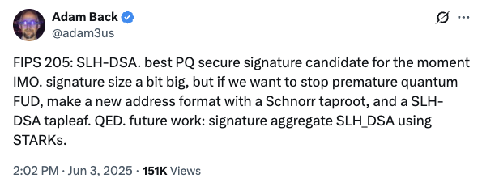

# 警惕抗量子骗局

BTC昨天刚刚作势拉升脱离30日均线，今天又回踩了一下30日均线（大约在104.9k附近）。

近日有多位读者朋友给教链转发有关量子计算以及大饼要在未来几年内归零的FUD（教链注：币圈术语，意为让听众产生恐惧、怀疑、困惑的感觉，以制造恐慌）。

量子计算FUD不说年年都有吧，也是每隔几年就要来上几发。但是怎么说呢，几乎所有大众能够看到的拿量子计算说什么大饼要归零的，有一个算一个都是忽悠；如果后续再趁机给你推荐几个所谓的抗量子币，那就基本上可以认定是骗局了。

但凡是看过教链有关于量子计算的文章，或者认真读过《比特币史话》中有关量子计算的章节，应该很容易一眼识破这类忽悠和骗局。

如果只是被忽悠，害怕归零而不敢持有大饼，那么不过是错过一些大饼未来上涨的机会而已；但是如果再被骗着去花钱买了什么狗屁抗量子币，那可就真要遭受财产损失了。

记住以下几个知识点：

第一，量子计算机达到实用水平还有多长的路要走？很长。至少比出来吹牛逼的那些人嘴里的5年8年要长得多得多。就像你经常听搞AI的人吹牛逼说203X年之前就能搞出来所谓AGI（通用人工智能），计算机在智能水平上彻底碾压人类。实际上呢，也许只不过是为了忽悠投资人拿钱给他们烧的话术罢了。也许10年，20年，50年，甚至在战争或天灾导致人类毁灭之前都没戏也说不定。

第二，如果量子计算机很快实用化，也许你首先应该担心一下你的传统银行账户里的钱还安全不安全。这些系统统统都很容易被实用化的量子计算攻破，比大饼要容易得多。大饼的地址是签名算法外面套了一层哈希，如果遵循教链在小白课上讲过的「每个地址只用一次」的使用原则，那么就是天然抗量子攻击的。这是因为大饼用的哈希有很强的量子抗性。

第三，大饼在技术上很容易把目前的签名算法更换成抗量子的签名算法。技术人员也在积极关注和研究抗量子算法的最新进展，并且采用确保时刻做好升级准备的先发制人策略。至于为什么现在不动手升级？那是因为现在提出来的那些个抗量子算法都太差劲了。倒不是说它们没有量子抗性，而是它们的签名尺寸实在是太太太大了，大到根本不能满足大饼系统的要求。

毕竟，一切问题最终都要落实到工程可行性上面来。《比特币史话》第三章第9话就介绍过当年中本聪针对签名算法的选择所重点考虑的正是尺寸因素。当年他是这么说的：

中本聪分别在 2010 年 1 月 29 日、5 月 20 日 和 7 月 25 日 三次参与比特币社区论坛话题讨论时解释道：“比特币使用的是椭圆曲线数字签名算法(EC-DSA)。这个算法只能用于数字签名，而不能用于加密。RSA两者都能做，但是我没有采用它，因为它要大一个数量级，这就不切实际了。”“不是说可执行程序的大小，而是说数据的大小。如果区块链、比特币地址、磁盘空间、带宽需求都大一个数量级，这就不太可行了。”

那么今天我们能看到的抗量子算法，尺寸相比于ECC或者RSA又当如何呢？答案是大数百到近千倍。比如[SPHINCS+算法](https://mp.weixin.qq.com/s/tEC_0MidVuse5Z_6V07DjA)，「较低安全级别的SLH-DSA-SHA2-128s签名大小约为8KB，而较高安全级别的SLH-DSA-SHA2-256f甚至达到50KB，比传统签名算法（如RSA或ECC，后者仅有64B）大得多，不适合对存储和带宽要求严格的场景。」

想象一下大饼的账本尺寸从今天不到1TB猛增一千倍到1EB会怎么样？任何一个目前鼓吹什么抗量子币的，必然用目前市面上已有的抗量子算法，后果就是尺寸太大以至于工程上完全是个废物，无法承载大吞吐量，并且会因为账本尺寸过大而严重削弱去中心化。

想当年中本聪仅仅因为RSA签名尺寸比ECC“大了一个数量级”就弃用RSA，并直言不讳地指出，“这就不切实际了”。可想而知，今天所有的抗量子算法，比目前算法的签名尺寸要大三四个数量级，任何说这种玩意儿比现在的大饼更好的人，非蠢即坏。

前些天，密码学家、Blockstream公司创始人Adam Back，也是中本聪在比特币白皮书参考资料里引用过的人，发了一些推文，阐述了一下他对于目前抗量子算法以及量子计算FUD的看法。

他说的是什么呢？

他说：「FIPS 205: SLH-DSA。目前我认为最佳的后量子安全签名候选方案。签名尺寸稍大，但若想阻止过早的量子恐慌（FUD），可设计一种新地址格式：结合Schnorr Taproot和SLH-DSA Tapleaf。证毕（QED）。未来工作：利用STARKs实现SLH-DSA的签名聚合。」

当然，作为密码学专家，他的话里用了很多术语，让普通人难以很快理解。简单地说，就是他认为由美国国家标准局（NIST）标准化的SLH-DSA算法（编号为FIPS 205）是目前最佳。这个SLH-DSA算法，其实就是教链在上面提到的SPHINCS+算法。

从技术上讲，SLH-DSA算法的优势在于无状态设计和高安全性（仅依赖哈希函数），但签名尺寸显著大于传统方案（如RSA或ML-DSA）。

然后他跟推作了一些补充解释：

「你可以在未来几年或几十年内逐步迁移到新的地址格式，这种格式既能使用Schnorr签名进行交易，又无需当下承担SLH-DSA签名带来的空间和费用开销。但若未来出现具备密码学威胁的量子计算机，你已做好应对准备。  

我青睐SLH-DSA，因为它基于SPHINCS+——这一算法本身是对1982年Winternitz签名的改进，而后者又源自1979年的Lamport签名，且依赖简单而稳健的数学假设。相比之下，其他多数NIST候选签名方案基于未经充分验证的新型数学假设，风险较高。  

Taproot地址本质上是未哈希的Schnorr公钥，但可通过调整（tweak）来揭示一个Tapleaf（包含SLH-DSA或其他操作码）。Taproot在设计之初便前瞻性地将Tapleaf的调整机制设计为抗量子安全的，以此替代哈希公钥的方案，体现了更优的工程智慧。 」

根据大饼BIP 341的设计标准，Tapleaf的调整（tagged_hash("TapLeaf", ...)）使用抗量子哈希（如SHA-256），确保即使量子计算机出现，脚本路径仍然安全。

他进一步解释说：

「比特币（应当对）量子计算做好准备，这样我们就不会因为信息不对称的混乱——那些对早期量子计算物理和算法渐进式改进的过度报道——而导致比特币价格波动，毕竟量子计算要达到密码学相关水平很可能还需要数十年时间。

在我看来最可能的结果是SLH-DSA永远不会被实际使用，因为在具备密码学意义的量子计算机建成之前很多年，它就会被更紧凑或支持签名聚合的方案所取代。但我们必须超越这种愚蠢的短期恐慌。而且这种准备本身就具有渐进式的实用价值。」

还有网友问他，疑似属于中本聪的那些持有大量BTC的早期挖矿地址怎么处理。对此，他给出了个人的猜想：

「我猜我们终将知道中本聪是否还在，以及他是否会在抗量子地址启用后的数十年间、但在具备密码学威胁的量子超级计算机出现之前转移那些比特币。

如果最终真的出现了具备密码学威胁的量子计算机，我们就能知道中本聪是否还在世并转移这些币。我的猜测是：对于那些届时仍未移动的比特币，ECDSA和Schnorr签名方案将被弃用。」
