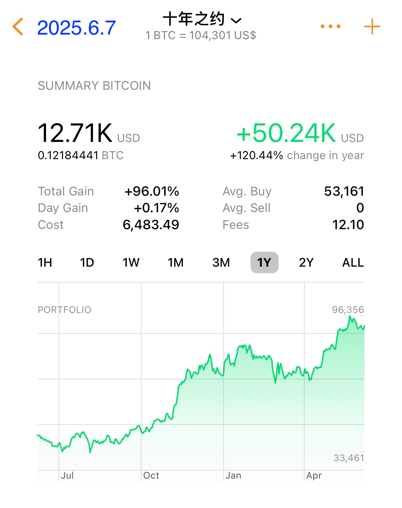
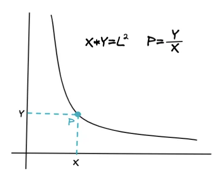
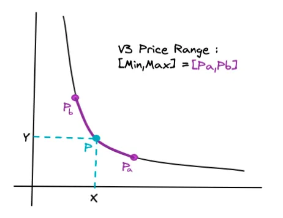

# 十年之约系列(48)：数学之美

昨天6号发了《铁打的县长，流水的夫人》，所以例行的十年之约实盘见证计划第48篇笔记就改到今天来发了。也就错过昨天回踩的机会，今天只得以市价104.8k增持一份。投后累计持仓约1218万聪，持仓成本53.1k，ROI 95%。

我们总是能够从事物的底层发现真正的美，数学之美。

譬如大饼的发行公式，加密行业最简洁有力的公式之一：

$$\sum_{n=0}^{32}{210k*\frac{50}{2^n}}=21M$$

又譬如Uniswap的恒定乘积做市商（CPMM）公式：

$$x*y=k$$

或者亦可写成：

$$x*y=L^2$$

及至V3、V4版本，又改进为区间做市公式以集中流动性，提升资本效率：

$$(x+a)(y+b)=k$$

亦有如下形式：

$$(x+\frac{L}{\sqrt{P_b}})(y+L\sqrt{P_a})=L^2$$

当我们发现美的时候，我们就能发现力量。

一说：世界上不缺少美，缺少的是发现的眼睛。

教链的理解是，美的事物自已环绕在你的周围，只是你却往往视而不见。

比如大饼自2009年诞生至今已愈16年，被各种媒体反复报道过，也时常出现在人们的讨论话题中，但仍然被许许多多人忽视、无视甚至敌视。

另一方面：真正的美又是稀缺的。

世上没有完美，但有相对更接近完美的美。

而近乎完美的事物，是极其稀少的。

一旦遇到，欣赏、拥抱，不要错过。

[gimmick:math]()
